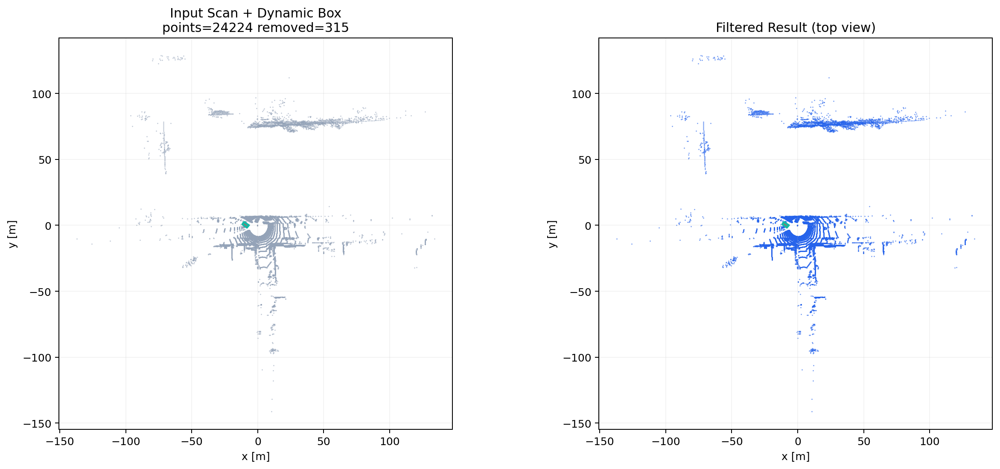
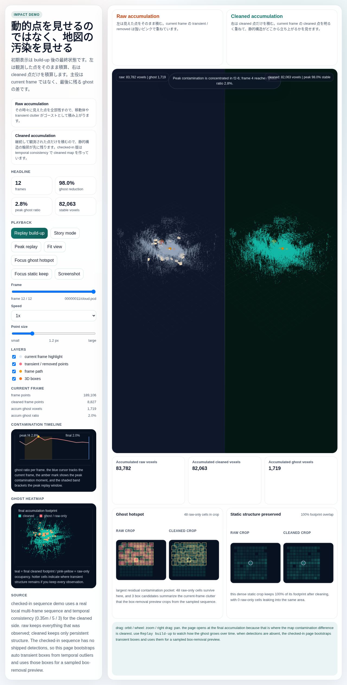

# Dynamic 3D Object Removal

動的物体の 3D バウンディングボックスを使って、点群から対象領域を除去するライブラリと可視化デモです。

## 最初に見る場所

- GitHub Pages / landing: https://rsasaki0109.github.io/dynamic-3d-object-removal/
- GitHub Pages / sequence proof demo: https://rsasaki0109.github.io/dynamic-3d-object-removal/demo/index_3d_sequence_standalone.html
- GitHub Pages / single-scan demo: https://rsasaki0109.github.io/dynamic-3d-object-removal/demo/index_3d_standalone.html

この repo の主役は sequence proof demo です。主張は次の 3 点です。

- raw accumulation は動的物体による不要な点群を地図に残しやすい
- cleaned accumulation はそうした不要な点群を抑える
- cleaned 側は静的構造まで無差別に消しているわけではない





## Checked-in 状態

### 単発デモ

- 入力は実スキャン `demo/actual_scan_20240820_cloud.pcd`
- 検出 box は `demo/actual_scan_20240820_objects.json`
- 現在の checked-in 結果は `24,224` 点入力、`315` 点除去、`23,909` 点保持

### 連続デモ

- 入力は real multi-frame sequence `graph/*/cloud.pcd`
- 左が `Raw accumulation`、右が `Cleaned accumulation`
- `ghost hotspot` と `static structure preserved` で必要性と安全性を同時に見せます
- `Story mode`、`contamination timeline`、`Peak replay`、`Peak burst` で「どのフレームでその影響が強まったか」を追えます

重要:

- 現在の checked-in sequence には repo 内に per-frame box JSON は入っていません
- そのため checked-in 版の cleaned 側は `temporal consistency` ベースです
- public page では、その outlier から導いた `auto transient boxes` を sampled box-removal preview と evidence 表示に使っています
- つまり checked-in sequence は、まだ「real per-frame detections で生成した demo」ではありません

## デモ再生成

### 単発デモを再生成

```bash
python3 demo/run_scan_demo.py \
  --input-cloud demo/actual_scan_20240820_cloud.pcd \
  --input-objects demo/actual_scan_20240820_objects.json \
  --max-render-points 220000 \
  --output-scene demo/demo_scene_single_scan.json \
  --output-html demo/index_3d_standalone.html
```

### 連続デモを再生成

```bash
python3 demo/run_scan_sequence_demo.py \
  --input-glob "/path/to/graph/*/cloud.pcd" \
  --frame-count 12 \
  --stride 1 \
  --max-render-points 9000 \
  --fps 4 \
  --voxel-size 0.35 \
  --window-size 5 \
  --min-hits 3 \
  --output-html demo/index_3d_sequence_standalone.html
```

- `--input-objects` を渡すと、cleaned 側を per-frame box 除去ベースで生成できます
- `--input-objects` を渡さない場合は `temporal consistency` で cleaned accumulation を作ります
- checked-in HTML は sampled point 群を内包する self-contained 形式です

### real per-frame boxes がある場合

```bash
python3 demo/run_scan_sequence_demo.py \
  --input-glob "/path/to/graph/*/cloud.pcd" \
  --input-objects /path/to/objects.json \
  --frame-count 12 \
  --stride 1 \
  --max-render-points 9000 \
  --fps 4 \
  --voxel-size 0.35 \
  --output-html demo/index_3d_sequence_standalone.html
```

`--input-objects` は次のどちらでも受けられます。

- 1つの共通 box payload
- `frame name -> payload` の map JSON

### 外部点群を単発デモ化

```bash
python3 demo/run_scan_demo.py \
  --input-cloud /path/to/map_or_scan.pcd \
  --input-objects /path/to/objects.json \
  --max-render-points 220000 \
  --output-scene demo/demo_scene_single_scan.json \
  --output-html demo/index_3d_scan_standalone.html
```

- `--input-objects` は省略可能です
- `PCD` は ASCII / binary に対応しています
- `DATA binary_compressed` は未対応です

## インストール

```bash
git clone git@github.com:rsasaki0109/dynamic-3d-object-removal.git
cd dynamic-3d-object-removal
python3 -m pip install -e .
```

## ライブラリ API

```python
from pathlib import Path
from dynamic_object_removal import load_points, load_boxes, remove_points_in_boxes, save_points

points = load_points(Path("/path/to/scan.pcd"), fmt="auto")
boxes = load_boxes(Path("/path/to/objects.json"), fmt="auto", skip_invalid=True)
kept, keep_mask = remove_points_in_boxes(points, boxes, margin=(0.05, 0.05, 0.05))
removed = points[~keep_mask]

save_points(Path("/path/to/output.xyz"), kept, fmt="auto")
```

主な公開 API:

- `load_points(path, fmt="auto")`
- `load_boxes(path, fmt="auto", skip_invalid=False)`
- `remove_points_in_boxes(points, boxes, margin=(0.05, 0.05, 0.05))`
- `TemporalConsistencyFilter(voxel_size=0.10, window_size=5, min_hits=3)`
- `save_points(path, fmt="auto")`

## CLI

```bash
dynamic-object-removal \
  --input-cloud /path/to/scan.pcd \
  --input-objects /path/to/objects.json \
  --output-cloud /path/to/output.xyz
```

```bash
dynamic-object-removal --help
```

## 外部地図点群の検証候補

- [map_utsukuba22_university_of_tsukuba.pcd](https://drive.google.com/file/d/1mSi6OP2p4jFwK3vVgvFIbCdxPmN4UcVg/view?usp=sharing)
  - 224 MB / 14.6M points / 2022
- [map_tc19_furo.pcd](https://drive.google.com/file/d/1mH20dXpnBBlQ6hMKJZqdVhphrffsvWK_/view?usp=sharing)
  - 683 MB / 22.3M points / 2019
- [map_tc18_furo.pcd](https://drive.google.com/file/d/1c7Vd4vkMudAHyxc0ZOZCbTgx8ZFZ_Slx/view?usp=sharing)
  - 519 MB / 17.0M points / 2018

取得時は `tsukubachallenge/tc-datasets` 側の配布形式に合わせてください。

## 参考

- [UTS-RI/dynamic_object_detection](https://github.com/UTS-RI/dynamic_object_detection)
