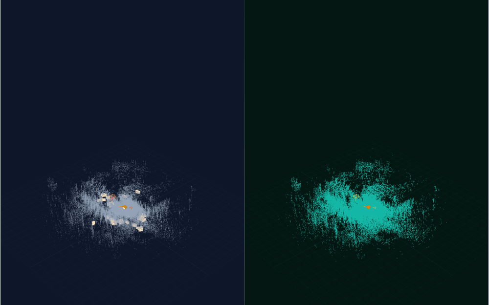
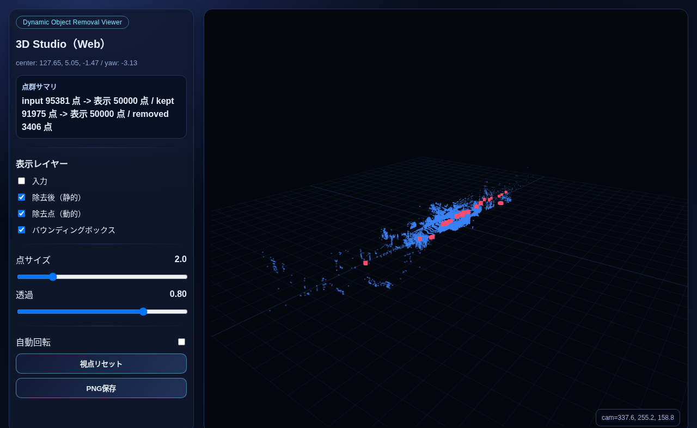

# Dynamic 3D Object Removal

動的物体の 3D バウンディングボックスを使って、点群から対象領域を除去するライブラリと可視化デモです。

## まずはこれ

メインの公開デモ:

- Sequence proof demo: https://rsasaki0109.github.io/dynamic-3d-object-removal/demo/index_3d_sequence_standalone.html

単発スキャン版:

- Single-scan demo: https://rsasaki0109.github.io/dynamic-3d-object-removal/demo/index_3d_standalone.html

Sequence demo では次の 3 点を見せます。

- 動的物体による不要な点群が accumulated map に残る
- cleaned accumulation はそれを抑える
- 静的構造は残る



補足:

- 公開中の sequence demo は repo 内に per-frame box JSON が無いため、cleaned 側を `temporal consistency` ベースで作っています
- per-frame box がある場合は `--input-objects` を渡して box-driven な sequence を再生成できます

## インストール

```bash
git clone git@github.com:rsasaki0109/dynamic-3d-object-removal.git
cd dynamic-3d-object-removal
python3 -m pip install -e .
```



## Quick start (公開データで試す)

[Argoverse 2](https://www.argoverse.org/av2.html) の実データを使って、3 コマンドで動的物体除去を体験できます。登録不要です。

```bash
# 1. Argoverse 2 サンプル (1 sweep + annotations, ~1.3 MB) をダウンロード
pip install awscli pyarrow
python3 scripts/download_av2_sample.py

# 2. 動的物体を除去 (車両 18 台 + 歩行者 3 人 + 自転車 1 台 + 車椅子 1 台)
dynamic-object-removal \
  --input-cloud data/av2_sample/lidar/315969904359876000.feather \
  --input-objects data/av2_sample/annotations.feather \
  --timestamp-ns 315969904359876000 \
  --output-cloud output/av2_cleaned.pcd

# 3. Before/After を 3D で確認
python3 demo/run_scan_demo.py \
  --input-cloud data/av2_sample/lidar/315969904359876000.feather \
  --input-objects data/av2_sample/annotations.feather \
  --timestamp-ns 315969904359876000 \
  --max-render-points 50000 \
  --output-html demo/index_3d_av2.html
```

> 95,381 点中 3,406 点 (3.6%) を除去 — 車両・歩行者・自転車が消え、道路・建物の静的構造が残ります

KITTI データも対応しています。詳しくは `scripts/download_kitti_sample.py` を参照してください。

## デモ再生成

### 単発スキャン

```bash
python3 demo/run_scan_demo.py \
  --input-cloud demo/actual_scan_20240820_cloud.pcd \
  --input-objects demo/actual_scan_20240820_objects.json \
  --max-render-points 220000 \
  --output-scene demo/demo_scene_single_scan.json \
  --output-html demo/index_3d_standalone.html
```

### Sequence

```bash
python3 demo/run_scan_sequence_demo.py \
  --input-glob "/path/to/graph/*/cloud.pcd" \
  --frame-count 12 \
  --stride 1 \
  --max-render-points 9000 \
  --fps 4 \
  --voxel-size 0.35 \
  --window-size 5 \
  --min-hits 3 \
  --output-html demo/index_3d_sequence_standalone.html
```

- `--input-objects` を渡すと、cleaned 側を per-frame box 除去ベースで生成できます
- `--input-objects` は 1 つの box payload でも `frame name -> payload` の map JSON でも受けられます
- checked-in HTML は sampled point 群を内包する self-contained 形式です

## CLI

```bash
dynamic-object-removal \
  --input-cloud /path/to/scan.pcd \
  --input-objects /path/to/objects.json \
  --output-cloud /path/to/output.xyz
```

```bash
dynamic-object-removal --help
```

## ライブラリ API

```python
from pathlib import Path
from dynamic_object_removal import load_points, load_boxes, remove_points_in_boxes, save_points

points = load_points(Path("/path/to/scan.pcd"), fmt="auto")
boxes = load_boxes(Path("/path/to/objects.json"), fmt="auto", skip_invalid=True)
kept, keep_mask = remove_points_in_boxes(points, boxes, margin=(0.05, 0.05, 0.05))

save_points(Path("/path/to/output.xyz"), kept, fmt="auto")
```

主な公開 API:

- `load_points(path, fmt="auto")`
- `load_boxes(path, fmt="auto", skip_invalid=False)`
- `remove_points_in_boxes(points, boxes, margin=(0.05, 0.05, 0.05))`
- `TemporalConsistencyFilter(voxel_size=0.10, window_size=5, min_hits=3)`
- `save_points(path, fmt="auto")`

## 対応形式

- 点群: `PCD` (ASCII / binary), `CSV`, `TXT`, `XYZ`, `NPY`, `BIN` (KITTI), `Feather` (Argoverse 2)
- バウンディングボックス: `JSON`, `CSV`, `KITTI label_2`, `Feather` (Argoverse 2)
- `PCD DATA binary_compressed` は未対応

## 参考

- [UTS-RI/dynamic_object_detection](https://github.com/UTS-RI/dynamic_object_detection)
