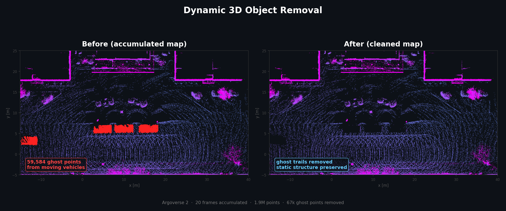
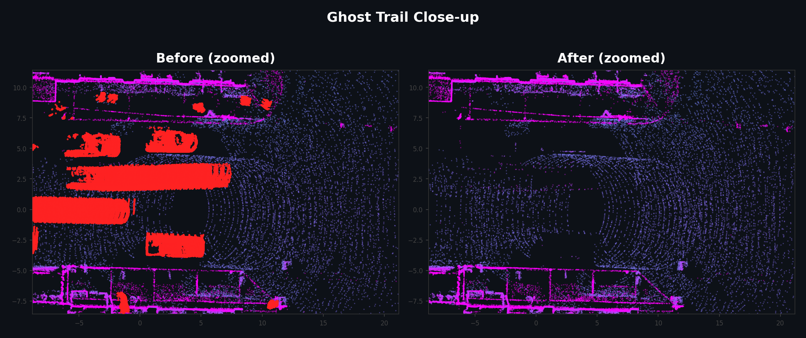

# Dynamic 3D Object Removal

[](https://github.com/rsasaki0109/dynamic-3d-object-removal/actions/workflows/test.yml)
[](https://github.com/rsasaki0109/dynamic-3d-object-removal/actions/workflows/gh-pages.yml)
[](https://github.com/rsasaki0109/dynamic-3d-object-removal/releases)

**No GPU, numpy-only, geometry-based**. This library removes dynamic objects from LiDAR point clouds without deep learning. For single scans it uses 3D bounding box cropping. For multi-frame sequences it uses voxel-based temporal filtering to reduce moving-object contamination.

## Start Here

- **AV2 public sequence demo**: https://rsasaki0109.github.io/dynamic-3d-object-removal/demo/index_3d_sequence_av2.html
- **Single-scan demo**: https://rsasaki0109.github.io/dynamic-3d-object-removal/demo/index_3d_standalone.html
- **Local sequence proof demo**: https://rsasaki0109.github.io/dynamic-3d-object-removal/demo/index_3d_sequence_standalone.html

What this repo is trying to prove first:

- You can compare a **pose-aligned 20-frame AV2 accumulated map**
- You can remove **233k ghost points (11.9%)** from a **2M-point raw accumulation**
- Dynamic trails are reduced while roads, buildings, and other static structure remain

These two hero images are **not single scans**. They show a **20-frame accumulated map**. For single-scan removal, see `Quick Start` and the `Single-scan demo`.





> 20-frame accumulated map from Argoverse 2 real data. This is not a single-scan comparison. It is a map-level ghost cleanup proof showing 233k ghost points removed (11.9%).

### Features

- **No deep learning**: give it detected 3D boxes and it removes points geometrically. No GPU, training data, or model inference required
- **Fast**: 1.5 ms for 24k points on CPU
- **ROS2 realtime node**: subscribe to `PointCloud2`, filter, and publish. Supports both `box` and `temporal` algorithms
- **Minimal dependencies**: `numpy` only. `pyarrow` is only needed for Argoverse 2 Feather input
- **Public proof artifacts**: checked-in single-scan, local sequence proof, and AV2 public sequence demos

What the sequence demos are meant to show:

- Raw accumulation creates ghost contamination
- Cleaned accumulation reduces it
- Stable static structure is preserved

Notes:

- The checked-in local sequence proof demo does not ship per-frame box JSON, so its cleaned side is generated with `temporal consistency`
- The AV2 public sequence demo uses `annotations.feather` and `city_SE3_egovehicle.feather` for pose-aligned, box-driven accumulation
- If per-frame boxes exist, pass `--input-objects` to regenerate a box-driven sequence
- If you want multiple frames aligned into a shared map frame, also pass `--input-poses`


## Installation

```bash
git clone https://github.com/rsasaki0109/dynamic-3d-object-removal.git
cd dynamic-3d-object-removal
python3 -m pip install -e .
```

## Quick Start On Public Data

You can try dynamic object removal on real [Argoverse 2](https://www.argoverse.org/av2.html) data in three commands. No signup is required.

```bash
# 1. Download an Argoverse 2 sample (1 sweep + annotations, ~1.3 MB)
pip install awscli pyarrow
python3 scripts/download_av2_sample.py

# 2. Remove dynamic objects (18 vehicles, 3 pedestrians, 1 bicycle, 1 wheelchair)
dynamic-object-removal \
  --input-cloud data/av2_sample/lidar/315969904359876000.feather \
  --input-objects data/av2_sample/annotations.feather \
  --timestamp-ns 315969904359876000 \
  --output-cloud output/av2_cleaned.pcd

# 3. Inspect before/after in 3D
python3 demo/run_scan_demo.py \
  --input-cloud data/av2_sample/lidar/315969904359876000.feather \
  --input-objects data/av2_sample/annotations.feather \
  --timestamp-ns 315969904359876000 \
  --max-render-points 50000 \
  --output-html demo/index_3d_av2.html
```

> Removes 3,406 points out of 95,381 (3.6%). Vehicles, pedestrians, and bicycles disappear while static road and building structure remains.

KITTI is also supported. See `scripts/download_kitti_sample.py`.

## Demo Regeneration

### Single Scan

```bash
python3 demo/run_scan_demo.py \
  --input-cloud demo/actual_scan_20240820_cloud.pcd \
  --input-objects demo/actual_scan_20240820_objects.json \
  --max-render-points 220000 \
  --output-scene demo/demo_scene_single_scan.json \
  --output-html demo/index_3d_standalone.html
```

### Sequence

```bash
python3 demo/run_scan_sequence_demo.py \
  --input-glob "/path/to/graph/*/cloud.pcd" \
  --frame-count 12 \
  --stride 1 \
  --max-render-points 9000 \
  --fps 4 \
  --voxel-size 0.35 \
  --window-size 5 \
  --min-hits 3 \
  --output-html demo/index_3d_sequence_standalone.html
```

- Pass `--input-objects` to build the cleaned side from per-frame box removal
- `--input-objects` accepts either a single box payload or a `frame name -> payload` JSON map
- Use `--input-objects /path/to/annotations.feather --input-poses /path/to/city_SE3_egovehicle.feather` to generate the AV2 public sequence in a shared map frame
- The checked-in HTML files are self-contained and embed sampled point data directly

## CLI

```bash
dynamic-object-removal \
  --input-cloud /path/to/scan.pcd \
  --input-objects /path/to/objects.json \
  --output-cloud /path/to/output.xyz
```

```bash
dynamic-object-removal --help
```

## ROS2 Realtime Node

The realtime node subscribes to `PointCloud2`, filters it, and publishes cleaned points.

```bash
# Box-driven removal with an external detector
dynamic-object-removal-realtime \
  --pointcloud-topic /velodyne_points \
  --objects-topic /detected_objects \
  --output-topic /cleaned_points \
  --algorithm box

# Temporal consistency without a detector
dynamic-object-removal-realtime \
  --pointcloud-topic /velodyne_points \
  --output-topic /cleaned_points \
  --algorithm temporal \
  --voxel-size 0.10 --temporal-window 5 --temporal-min-hits 3
```

```bash
dynamic-object-removal-realtime --help
```

## Library API

```python
from pathlib import Path
from dynamic_object_removal import load_points, load_boxes, remove_points_in_boxes, save_points

points = load_points(Path("/path/to/scan.pcd"), fmt="auto")
boxes = load_boxes(Path("/path/to/objects.json"), fmt="auto", skip_invalid=True)
kept, keep_mask = remove_points_in_boxes(points, boxes, margin=(0.05, 0.05, 0.05))

save_points(Path("/path/to/output.xyz"), kept, fmt="auto")
```

Main public APIs:

- `load_points(path, fmt="auto")`
- `load_boxes(path, fmt="auto", skip_invalid=False)`
- `remove_points_in_boxes(points, boxes, margin=(0.05, 0.05, 0.05))`
- `TemporalConsistencyFilter(voxel_size=0.10, window_size=5, min_hits=3)`
- `save_points(path, fmt="auto")`

## Supported Formats

- Point clouds: `PCD` (ASCII / binary), `CSV`, `TXT`, `XYZ`, `NPY`, `BIN` (KITTI), `Feather` (Argoverse 2)
- Bounding boxes: `JSON`, `CSV`, `KITTI label_2`, `Feather` (Argoverse 2)
- `PCD DATA binary_compressed` is not supported

## Related Work

- [UTS-RI/dynamic_object_detection](https://github.com/UTS-RI/dynamic_object_detection)
