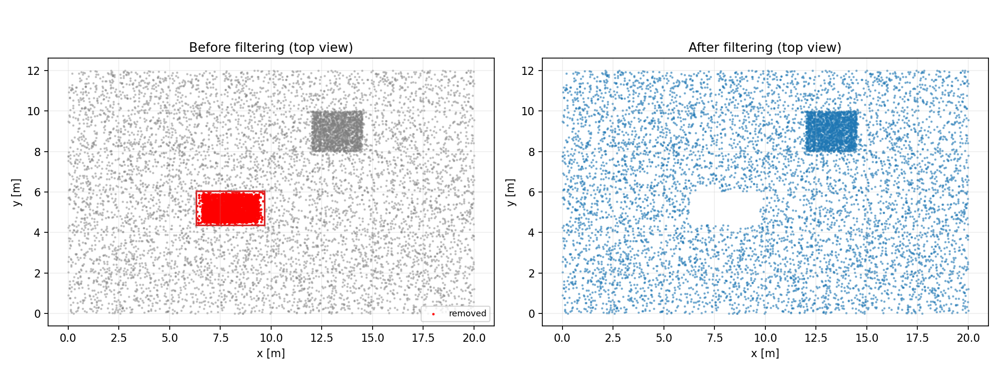
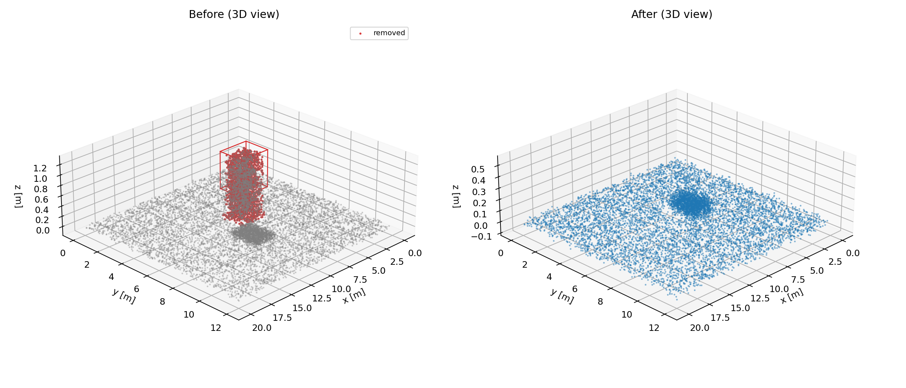
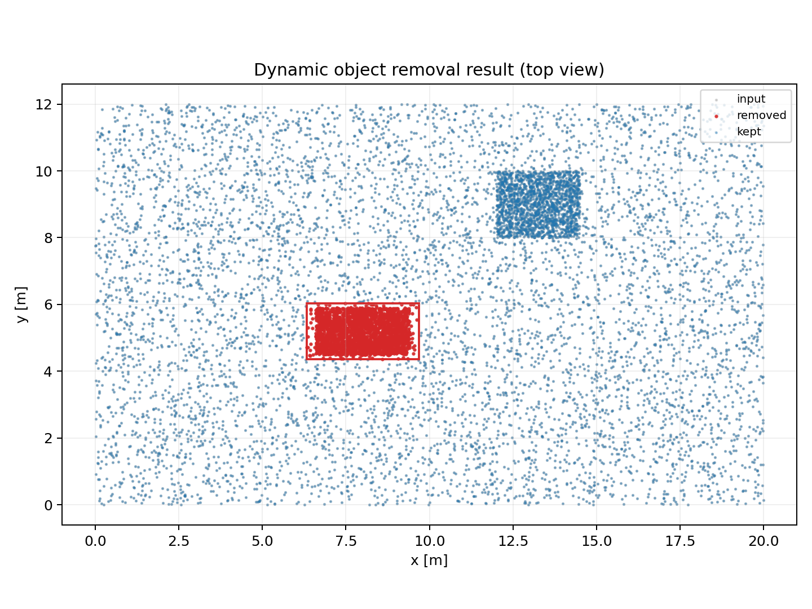

# Dynamic 3D Object Removal

動的物体検出の 3D バウンディングボックスを使って、点群から除去対象点を取り除きます。

## 最短セットアップ

```bash
git clone git@github.com:rsasaki0109/dynamic-3d-object-removal.git
cd dynamic-3d-object-removal
python3 -m pip install -e .
# ROS2を使う場合
# python3 -m pip install -e .[ros2]
```

## 使い方

```bash
dynamic-object-removal \
  --input-cloud path/to/input.xyz \
  --input-objects path/to/objects.json \
  --output-cloud path/to/output.xyz
```

## デモ（再現）

```bash
cd demo
python3 run_demo.py
python3 -m http.server 4173
```

ブラウザで `http://127.0.0.1:4173/index_3d.html` を開く。

最新を再生成して開き直すには:

```bash
cd demo
./open_latest_report.sh --safe
```

### GitHub Pages 公開

- ブランチ `master` の push をトリガーに、GitHub Pages を自動更新します。
- 公開先: `https://rsasaki0109.github.io/dynamic-3d-object-removal/`
- デモ:
  - `https://rsasaki0109.github.io/dynamic-3d-object-removal/demo/index.html`
  - `https://rsasaki0109.github.io/dynamic-3d-object-removal/demo/index_3d.html`
  - `https://rsasaki0109.github.io/dynamic-3d-object-removal/demo/index_3d_standalone.html`

## 対応データ

- 点群: `*.xyz`, `*.pcd`, `*.csv`, `*.txt`, `*.npy`
- 物体: JSON 配列、または `{ "objects": [...] }`

物体1件例:
- `center`: `[x, y, z]`
- `size` または `dimensions`: `[dx, dy, dz]`
- `yaw` または `orientation`

## 3Dビュー

- `demo/index_3d_standalone.html`: ファイルを直接開いて確認
- `demo/index_3d.html`: `demo_scene.json` を読み込むサーバ版

どちらも、
- Input/Kept/Removed 表示切替
- BBox 表示切替
- 点サイズ/透過率調整
- 回転・ズーム
- PNG 保存

を備えています。

## デモ結果

- 対象点群: `demo/demo_input.xyz`（11,000 点）
- 除去結果: `demo/demo_output.xyz`（8,633 点）
- 除去点: 2,367 点（約 21.5%）
- 参照シーン: `demo/demo_scene.json`





## 参考 OSS

- `dynamic_object_detection` (ROS1/ROS2向け実装)
  - https://github.com/UTS-RI/dynamic_object_detection
  - ライセンス: MIT
- NumPy
  - https://numpy.org/doc/stable/license/
  - ライセンス: BSD-3-Clause
- Matplotlib
  - https://matplotlib.org/stable/users/license.html
  - ライセンス: Python Software Foundation License（BSD 互換）
- Three.js
  - https://github.com/mrdoob/three.js/
  - ライセンス: MIT
- rclpy (ROS 2 Python client library)
  - https://github.com/ros2/rclpy
  - ライセンス: Apache-2.0

## ライセンス

MIT License

参照 OSS のライセンス互換性を確認し、同梱コードは本プロジェクト側を MIT で公開します。
