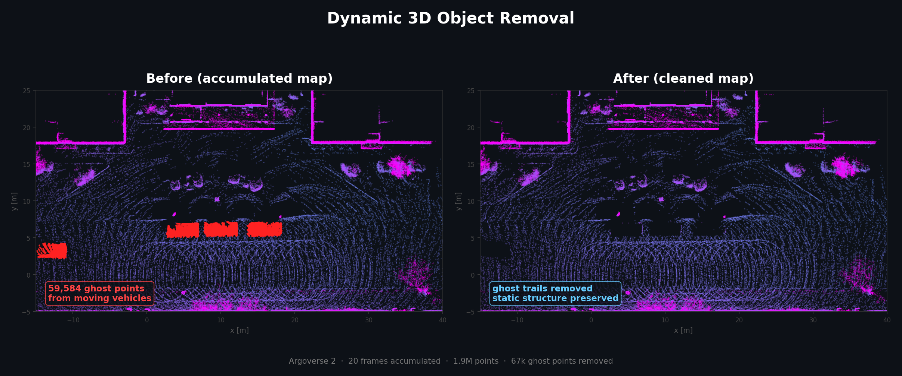
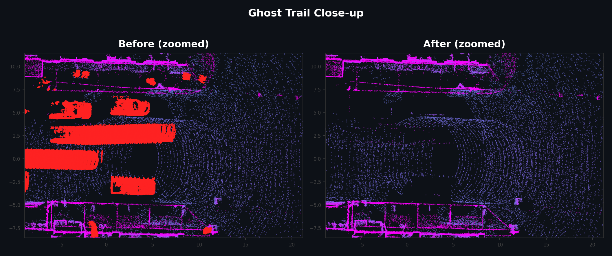
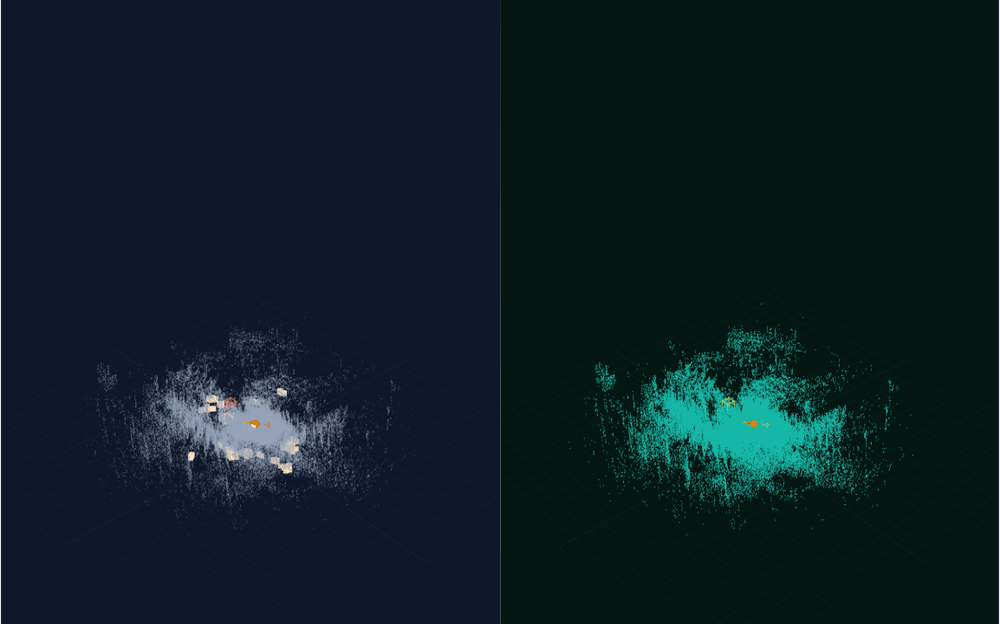

# Dynamic 3D Object Removal

[](https://github.com/rsasaki0109/dynamic-3d-object-removal/actions/workflows/test.yml)
[](https://rsasaki0109.github.io/dynamic-3d-object-removal/demo/playground.html)
[](https://github.com/rsasaki0109/dynamic-3d-object-removal/releases)

**No GPU, numpy-only, geometry-based**. This library removes dynamic objects from LiDAR point clouds without deep learning. For single scans it uses 3D bounding box cropping. For multi-frame sequences it uses voxel-based temporal filtering to reduce moving-object contamination.

## Start Here

- **🕹️ Interactive browser playground (no install)**: https://rsasaki0109.github.io/dynamic-3d-object-removal/demo/playground.html — the real `numpy` library runs in your browser via Pyodide. Flip between all three algorithms on the same scene: **Box mode** (drop your own LiDAR scan and watch dynamic objects get removed in 3D), **Range mode** (detector-free range-image visibility across pose-aligned scans), and **Temporal mode** (detector-free voxel consistency — simplest, more aggressive) — a live look at the precision/recall trade-off, no boxes or labels needed for the two detector-free modes. **Shareable URLs** preserve mode, preset (AV2 64-beam or nuScenes 32-beam), and algorithm knobs — use the **Share** button to copy a link.

  [](https://rsasaki0109.github.io/dynamic-3d-object-removal/demo/playground.html)

  > The exact `dynamic_object_removal.py` from this repo, running client-side on a 95k-point Argoverse 2 scan. No GPU, no upload, no signup.

- **AV2 public sequence demo**: https://rsasaki0109.github.io/dynamic-3d-object-removal/demo/index_3d_sequence_av2.html
- **Single-scan demo**: https://rsasaki0109.github.io/dynamic-3d-object-removal/demo/index_3d_standalone.html
- **Local sequence proof demo**: https://rsasaki0109.github.io/dynamic-3d-object-removal/demo/index_3d_sequence_standalone.html

What this repo is trying to prove first:

- You can compare a **pose-aligned 20-frame AV2 accumulated map**
- You can remove **233k ghost points (11.9%)** from a **2M-point raw accumulation**
- Dynamic trails are reduced while roads, buildings, and other static structure remain

These two hero images are **not single scans**. They show a **20-frame accumulated map**. For single-scan removal, see `Quick Start` and the `Single-scan demo`.





> 20-frame accumulated map from Argoverse 2 real data. This is not a single-scan comparison. It is a map-level ghost cleanup proof showing 233k ghost points removed (11.9%).

### Features

- **No deep learning**: give it detected 3D boxes and it removes points geometrically. No GPU, training data, or model inference required
- **Five algorithms, all numpy**: `box` (per-scan, needs boxes), `temporal` (detector-free voxel consistency), `range` (detector-free range-image visibility — Removert-style remove + revert), `scan_ratio` (detector-free per-column pseudo-occupancy — ERASOR-style scan-ratio + ground revert), and `fusion` (free-space carving + DUFOMap-style eroded voids + scan-ratio votes, OR-fused — the highest-accuracy map cleaner)
- **Fast**: 1.5 ms for 24k points on CPU
- **ROS2 realtime node**: subscribe to `PointCloud2`, filter, and publish. Supports `box`, `temporal`, and `range` algorithms
- **Minimal dependencies**: `numpy` only. `pyarrow` is only needed for Argoverse 2 Feather input
- **Public proof artifacts**: checked-in single-scan, local sequence proof, and AV2 public sequence demos

What the sequence demos are meant to show:

- Raw accumulation creates ghost contamination
- Cleaned accumulation reduces it
- Stable static structure is preserved

Notes:

- The checked-in local sequence proof demo does not ship per-frame box JSON, so its cleaned side is generated with `temporal consistency`
- The AV2 public sequence demo uses `annotations.feather` and `city_SE3_egovehicle.feather` for pose-aligned, box-driven accumulation
- If per-frame boxes exist, pass `--input-objects` to regenerate a box-driven sequence
- If you want multiple frames aligned into a shared map frame, also pass `--input-poses`



## How It Compares

Two well-known geometry-based (no deep learning) dynamic-removal methods are [ERASOR](https://github.com/LimHyungTae/ERASOR) (RA-L/ICRA '21) and [Removert](https://github.com/gisbi-kim/removert) (IROS '20). They solve a **different** problem than this project: they clean a *finished, pose-aligned accumulated map offline*. This project focuses on *online, per-scan* removal. The table is a positioning guide to help you pick the right tool — **not** a re-run benchmark.

| | **This project** | ERASOR | Removert |
|---|---|---|---|
| Primary goal | Per-scan / realtime removal + map cleaning | Offline static-map cleaning | Offline static-map cleaning |
| Needs a detector / 3D boxes | `box`: yes · `temporal`/`range`: no | No | No |
| Needs poses | `box`/`temporal`: no · `range`: yes (map + poses) | Yes (map + poses) | Yes (scans + poses) |
| Online / realtime | **Yes** (ROS2 node) | No (batch) | No (batch) |
| Deep learning | No | No | No |
| Core stack | `numpy` only | C++ / ROS / PCL | C++ / ROS / PCL |
| Best when | Filtering live in a SLAM pipeline, or a quick per-scan cleanup | Cleaning a completed accumulated map | Fine-refining a static map after a coarse pass |

If you need a detector-free, map-level cleaner for a finished sequence, ERASOR / Removert are excellent and purpose-built for it. If you want a tiny dependency-free filter you can run per scan (or live over ROS2) — and you already have boxes or are fine with voxel temporal consistency — this project is the lighter fit. Characteristics above are from each method's paper and repository, not re-measured here.

### Measured on Argoverse 2 (this repo's own detector-free methods)

These numbers **are** re-measured here, on real public data, and are reproducible with one command. We accumulate a pose-aligned 12-sweep map from an Argoverse 2 val log, take ground truth as the points on objects whose track actually moved (a motion-based method should not be expected to remove parked cars), and score each detector-free algorithm. This is *our* methods only — not ERASOR/Removert.

| method (detector-free) | precision | recall | F1 | static points kept |
|---|---|---|---|---|
| **free-space fusion** (`fusion`, short-window thresholds) | 0.65 | **0.66** | **0.66** | 0.97 |
| **range-image visibility** (`range`) | **0.68** | 0.54 | 0.60 | 0.98 |
| **scan-ratio** pseudo-occupancy (`scan_ratio`, `--sr-min-votes 2`) | 0.66 | 0.56 | 0.61 | 0.98 |
| temporal consistency (`temporal`) | 0.19 | 0.72 | 0.30 | 0.78 |

> Scene `0b5142c1…`, 1.24 M points, 84 k ground-truth points on moving objects. The range-image cleaner uses see-through voting + a Removert-style *revert* (a repeatedly-observed surface is kept even if a few scans see past it) + ground protection. Tunable for higher precision (e.g. `--min-see-through 4` → precision ≈ 0.89).
>
> **fusion** transfers to this dense-sensor short window with one adaptation: the
> library's thresholds (`free_votes_fraction=0.9`, `void_min_scans=11`) assume a long
> KITTI-style sequence — with only 12 sweeps a single same-scan hit would veto the
> fractional vote and 11 absolute voids can never accumulate. The benchmark script
> relaxes them to `0.7 / floor 3 / 4` (its defaults), which lifts fusion from F1 0.39
> to 0.66 — the best F1 here.
>
> **scan-ratio** is a *different geometric signal* (ERASOR-style): it compares the **vertical occupancy of each egocentric polar column** between the map and a live sweep — a column that is tall in the map but flat now held a moving object — and reverts the ground underneath with a per-column plane fit. It reaches the same ~0.60 F1 as the visibility method by an **independent** mechanism (column occupancy vs line-of-sight), and tends toward **higher recall** (it also catches dynamics that are never occluded). Voting across scans controls the precision/recall trade: the default (majority of each point's column revisits, v0.4.0) targets long accumulated maps (100+ scans) and on this 12-sweep snapshot trades recall for precision (0.89 precision / 0.18 recall — most of a trace's revisits still contain the object); a small fixed `--sr-min-votes 2` is the right setting for short windows and is what this row reports.

```bash
# Reproduce (downloads a few AV2 sweeps, no signup):
pip install awscli pyarrow
python3 scripts/run_av2_benchmark.py --frames 12
```

### Also measured on nuScenes (a second dataset / sensor)

To check the range-image method isn't tuned to one sensor, it is also measured on the
public **nuScenes mini** split (also no signup — served anonymously over HTTPS). nuScenes
uses a **32-beam** LiDAR, roughly **5× sparser per range-image pixel** than AV2's dense
sweep (~5 vs ~27 points per occupied pixel). The single change that matters is to **match
the range-image resolution to the beam density** — a coarser image (`2.5°` vs AV2's `1.0°`)
so each pixel still aggregates enough points. With that one change the method generalizes:

| method (detector-free) | precision | recall | F1 | static points kept |
|---|---|---|---|---|
| **range ∧ scan-ratio** (intersection) | 0.51 | 0.87 | **0.64** | 0.84 |
| range-image visibility (`range`) | 0.48 | **0.92** | 0.63 | 0.81 |
| scan-ratio pseudo-occupancy (`scan_ratio`) | 0.36 | **0.90** | 0.51 | 0.69 |
| free-space fusion (`fusion`, short-window thresholds) | 0.16 | 0.32 | 0.22 | 0.68 |
| temporal consistency (`temporal`) | 0.07 | 0.22 | 0.11 | 0.47 |

> Scene `scene-0757` (busy intersection), 12 pose-aligned keyframes, 303 k points, 49 k
> ground-truth points on moving objects. Using AV2's fine `1.0°` resolution here instead
> collapses F1 to ~0.30: with too few points per pixel the nearest-range estimate gets
> noisy and static structure is spuriously *seen through*. Coarsening the image is the fix —
> the same see-through-voting + *revert* algorithm, just sized to the sensor.
>
> The **scan-ratio** method is the honest cautionary case for the same beam-density lesson:
> its column-occupancy signal is *more* sensitive to sparsity than visibility (a 32-beam
> sweep often leaves a column nearly empty → flat → flagged), so on nuScenes it keeps recall
> very high but precision and static-preservation drop. It is strongest on dense (64-beam+)
> sensors like AV2; on sparse sensors prefer `range`, or raise `votes_fraction`.
>
> Its false positives are, however, nearly disjoint from `range`'s (range-image
> self-occlusion vs polar-column vacancy — different physics), so **intersecting the two
> dynamic masks** beats either alone on every precision-side metric at no extra cost:
> F1 0.63 → 0.64 and static preservation 0.81 → 0.84, giving up only a little recall
> (0.92 → 0.87). The masks are plain numpy arrays — `keep = keep_range | keep_sr`.
>
> **fusion** is the same lesson taken further: its voxel free-space carving relies on a
> scan's own surface hits protecting static structure, but beyond ~13 m the 32-beam
> vertical spacing exceeds the carving voxel, so static walls get carved *between* beams.
> Unlike the range image, coarsening the voxels does not recover it (measured F1 stays
> < 0.3 across coarser voxel / shorter range / per-channel variants). `fusion` is the
> right tool for dense sensors (best-in-table on AV2 and Semantic-KITTI); on sparse
> 32-beam data use `range`, optionally intersected with `scan_ratio` (top row above).

```bash
# Reproduce (downloads nuScenes mini once, ~3.9 GB stream, no signup, no extra deps):
python3 scripts/run_nuscenes_benchmark.py
```

### Measured on Semantic-KITTI (DynamicMap_Benchmark format)

These numbers use the [KTH-RPL DynamicMap_Benchmark](https://github.com/KTH-RPL/DynamicMap_Benchmark)
teaser sequences on Zenodo (pose-attached per-scan PCDs, human-labeled `gt_cloud.pcd`).
Metrics are the benchmark's **SA / DA / AA / HA** (static accuracy, dynamic accuracy,
geometric & harmonic means). Same detector-free defaults as the AV2 run (VLP-64 → `1.0°`
range image). **Our methods only** — not ERASOR/Removert/DUFOMap re-runs.

| method | seq 00 SA | seq 00 DA | seq 00 AA | seq 05 SA | seq 05 DA | seq 05 AA |
|---|---|---|---|---|---|---|
| **range-image visibility** (`range`) | **99.6** | 34.5 | 58.6 | **99.8** | 25.9 | 50.9 |
| **scan-ratio** pseudo-occupancy (`scan_ratio`) | 98.0 | 92.8 | 95.4 | 96.0 | 97.9 | 96.9 |
| **free-space fusion** (`fusion`) | 98.9 | **98.3** | **98.6** | 98.0 | **98.1** | **98.0** |
| temporal consistency (`temporal`) | 97.0 | 46.6 | 67.2 | 97.3 | 25.9 | 50.2 |

> seq 00: 141 scans, 17.4 M points, 96 k dynamic GT points. seq 05: 321 scans, 39.9 M
> points, 684 k dynamic GT points. **range** preserves static structure (SA ≈ 99%) but is
> conservative on dynamics (DA ≈ 26–35%). **scan-ratio** balances both: votes are
> normalized per point by the number of scans that actually revisit its polar column
> (majority rule, v0.4.0), which protects rarely-observed static points. **fusion**
> (v0.5.0) OR-combines three complementary evidence channels — ray-sampled free-space
> carving with per-scan hit precedence, DUFOMap-style eroded void confirmation
> (d_s hit inflation + full-26-neighborhood erosion), and the scan-ratio votes at a
> stricter fraction — and is the strongest method here. For context, the benchmark's
> public leaderboard tops out at DUFOMap with AA 98.6 (seq 00) / 96.3 (seq 05):
> `fusion` matches it on seq 00 and exceeds every listed method on seq 05 (the
> learning-based, GPU-trained 4dNDF reports AA ≈ 99 on both — outside this
> numpy-only, detector-free class). Channel thresholds were tuned on these two
> sequences, like most leaderboard entries; cross-dataset transfer is measured in the
> sections above — fusion is also best-in-table on the dense-sensor AV2 short window
> (with relaxed short-window thresholds), but not suited to sparse 32-beam nuScenes,
> where `range` is the right tool.

```bash
# Reproduce (downloads Zenodo teaser zips, ~385 MB each; scipy speeds up eval):
python3 scripts/run_dynamicmap_benchmark.py --sequences 00 05
```

## Installation

```bash
pip install dynamic-object-removal
```

That is the whole install — one pure-Python wheel, `numpy` its only dependency (no GPU,
no compiler, no deep-learning stack). It gives you the `dynamic_object_removal` library and
the `dynamic-object-removal` CLI. Optional extras: `pip install "dynamic-object-removal[ros2]"`
for the ROS2 node, `pip install "dynamic-object-removal[benchmarks]"` for the AV2/nuScenes
reproduction scripts.

From source (for development):

```bash
git clone https://github.com/rsasaki0109/dynamic-3d-object-removal.git
cd dynamic-3d-object-removal
python3 -m pip install -e .
```

## Quick Start On Public Data

You can try dynamic object removal on real [Argoverse 2](https://www.argoverse.org/av2.html) data in three commands. No signup is required.

```bash
# 1. Download an Argoverse 2 sample (1 sweep + annotations, ~1.3 MB)
pip install awscli pyarrow
python3 scripts/download_av2_sample.py

# 2. Remove dynamic objects (18 vehicles, 3 pedestrians, 1 bicycle, 1 wheelchair)
dynamic-object-removal \
  --input-cloud data/av2_sample/lidar/315969904359876000.feather \
  --input-objects data/av2_sample/annotations.feather \
  --timestamp-ns 315969904359876000 \
  --output-cloud output/av2_cleaned.pcd

# 3. Inspect before/after in 3D
python3 demo/run_scan_demo.py \
  --input-cloud data/av2_sample/lidar/315969904359876000.feather \
  --input-objects data/av2_sample/annotations.feather \
  --timestamp-ns 315969904359876000 \
  --max-render-points 50000 \
  --output-html demo/index_3d_av2.html
```

> Removes 3,406 points out of 95,381 (3.6%). Vehicles, pedestrians, and bicycles disappear while static road and building structure remains.

KITTI is also supported. See `scripts/download_kitti_sample.py`.

## Demo Regeneration

### Single Scan

```bash
python3 demo/run_scan_demo.py \
  --input-cloud demo/actual_scan_20240820_cloud.pcd \
  --input-objects demo/actual_scan_20240820_objects.json \
  --max-render-points 220000 \
  --output-scene demo/demo_scene_single_scan.json \
  --output-html demo/index_3d_standalone.html
```

### Sequence

```bash
python3 demo/run_scan_sequence_demo.py \
  --input-glob "/path/to/graph/*/cloud.pcd" \
  --frame-count 12 \
  --stride 1 \
  --max-render-points 9000 \
  --fps 4 \
  --voxel-size 0.35 \
  --window-size 5 \
  --min-hits 3 \
  --output-html demo/index_3d_sequence_standalone.html
```

- Pass `--input-objects` to build the cleaned side from per-frame box removal
- `--input-objects` accepts either a single box payload or a `frame name -> payload` JSON map
- Use `--input-objects /path/to/annotations.feather --input-poses /path/to/city_SE3_egovehicle.feather` to generate the AV2 public sequence in a shared map frame
- The checked-in HTML files are self-contained and embed sampled point data directly

## CLI

```bash
dynamic-object-removal \
  --input-cloud /path/to/scan.pcd \
  --input-objects /path/to/objects.json \
  --output-cloud /path/to/output.xyz
```

```bash
dynamic-object-removal --help
```

Detector-free range-image visibility removal (clean an accumulated map with a query sweep):

```bash
dynamic-object-removal \
  --algorithm range \
  --input-map accumulated_map.npy \
  --input-cloud query_sweep.npy \
  --sensor-origin 0 0 0 \
  --output-cloud cleaned_map.npy
```

Detector-free scan-ratio (pseudo-occupancy) removal — swap `--algorithm range` for
`--algorithm scan_ratio` (same map + query inputs):

```bash
dynamic-object-removal \
  --algorithm scan_ratio \
  --input-map accumulated_map.npy \
  --input-cloud query_sweep.npy \
  --sensor-origin 0 0 0 \
  --output-cloud cleaned_map.npy
```

## ROS2 Realtime Node

The realtime node subscribes to `PointCloud2`, filters it, and publishes cleaned points.

```bash
# Box-driven removal with an external detector
dynamic-object-removal-realtime \
  --pointcloud-topic /velodyne_points \
  --objects-topic /detected_objects \
  --output-topic /cleaned_points \
  --algorithm box

# Temporal consistency without a detector
dynamic-object-removal-realtime \
  --pointcloud-topic /velodyne_points \
  --output-topic /cleaned_points \
  --algorithm temporal \
  --voxel-size 0.10 --temporal-window 5 --temporal-min-hits 3
```

```bash
dynamic-object-removal-realtime --help
```

## Library API

```python
from pathlib import Path
from dynamic_object_removal import load_points, load_boxes, remove_points_in_boxes, save_points

points = load_points(Path("/path/to/scan.pcd"), fmt="auto")
boxes = load_boxes(Path("/path/to/objects.json"), fmt="auto", skip_invalid=True)
kept, keep_mask = remove_points_in_boxes(points, boxes, margin=(0.05, 0.05, 0.05))

save_points(Path("/path/to/output.xyz"), kept, fmt="auto")
```

Main public APIs:

- `load_points(path, fmt="auto")`
- `load_boxes(path, fmt="auto", skip_invalid=False)`
- `remove_points_in_boxes(points, boxes, margin=(0.05, 0.05, 0.05))`
- `TemporalConsistencyFilter(voxel_size=0.10, window_size=5, min_hits=3)`
- `remove_ghost_by_range_image(map_points, query_points, sensor_origin, range_margin=0.5)` — single map-vs-scan visibility removal
- `clean_map_by_visibility(map_points, scans, min_see_through=2, max_surface_hits=2, ground_z=None, resolutions=None)` — multi-scan map cleaner (remove + revert); pass `resolutions=[2.5, 4.0]` for multi-resolution consensus (higher precision)
- `remove_dynamic_by_scan_ratio(map_points, query_points, sensor_origin, scan_ratio_threshold=0.2, ground_margin=0.2)` — single map-vs-scan ERASOR-style per-column pseudo-occupancy removal
- `clean_map_by_scan_ratio(map_points, scans, scan_ratio_threshold=0.2, min_votes=None, votes_fraction=0.5, votes_floor=3)` — multi-scan scan-ratio cleaner (vote across sweeps; `min_votes=None` = majority of each point's column revisits)
- `clean_map_by_fusion(map_points, scans, workers=1)` — highest-accuracy map cleaner: OR-fuses free-space carving, DUFOMap-style eroded voids, and scan-ratio votes (set `workers` to parallelize the per-scan carving)
- `RangeImageGhostFilter(window_size=5, range_margin=0.5)` — streaming range-image filter for ROS2
- `save_points(path, fmt="auto")`

### Range-image visibility removal

```python
from dynamic_object_removal import clean_map_by_visibility

# scans: list of (points_in_map_frame, sensor_origin) from the sweeps that built the map.
kept, keep_mask = clean_map_by_visibility(
    map_points, scans,
    range_margin=0.5, min_see_through=2, max_surface_hits=2, ground_z=-1.4,
)
```

A map point is removed only when enough scans see *through* it (free space) **and** few scans confirm it as a real surface — the Removert-style *revert* guard that stops static structure from being eroded. Try it live (detector-free, runs in your browser) in the **Range mode** of the [playground](https://rsasaki0109.github.io/dynamic-3d-object-removal/demo/playground.html).

### Scan-ratio (pseudo-occupancy) removal

```python
from dynamic_object_removal import clean_map_by_scan_ratio

# scans: list of (points_in_map_frame, sensor_origin) from the sweeps that built the map.
# By default a point is removed when a majority of the scans revisiting its
# column vote dynamic; pass an int min_votes for a fixed absolute threshold.
kept, keep_mask = clean_map_by_scan_ratio(
    map_points, scans,
    scan_ratio_threshold=0.2, min_map_height=0.5, ground_margin=0.2,
)
```

An **independent** geometric signal from the visibility methods (ERASOR-style): each egocentric polar column stores its vertical occupancy (height spread). A column that is tall in the accumulated map but flat in a live sweep held a moving object, so its above-ground points are removed and the ground is reverted by a per-column plane fit. It complements `range` — same ~0.60 F1 on AV2 by a different mechanism, with a recall bias — and is strongest on dense (64-beam+) LiDAR; on sparse sensors (e.g. nuScenes 32-beam) prefer `range` or raise `votes_fraction`.

**Higher-precision (multi-resolution consensus).** Pass `resolutions=[2.5, 4.0]` (Removert-style): a point is removed only if it is seen through at *every* listed resolution, which filters resolution-specific noise. This trades a little recall for precision — on the AV2 benchmark it lifts precision **0.68 → 0.78** (static-points-kept 0.98 → 0.99), and on sparse sensors it also nudges F1 up. Prefer it when wrongly deleting static structure is worse than missing a few dynamic points. Both benchmark scripts expose it via `--resolutions 2.5 4.0`.

### Free-space fusion (highest accuracy)

```python
from dynamic_object_removal import clean_map_by_fusion

# scans: list of (points_in_map_frame, sensor_origin) from the sweeps that built the map.
kept, keep_mask = clean_map_by_fusion(map_points, scans, workers=6)
```

Three independent dynamic-evidence channels, OR-fused (a point is removed if any
channel flags it):

1. **Free-space carving** — rays are sampled toward each scan point and stop short of
   the hit; voxels a scan traverses without hitting are *freed* for that scan
   (hit precedence), and a point is dynamic when ≥ 90 % of the scans that observed its
   voxel freed it. Near-perfect precision on transient traffic.
2. **Eroded voids** (DUFOMap-style) — finer carving where the last 0.2 m of each ray
   counts as hit, miss rays stop at the scan's own hit set, and a miss becomes a
   *confirmed void* only when its entire 26-neighborhood was observed in the same scan.
   A point is dynamic after 11 confirmed voids — an absolute count, which catches slow
   movers and late leavers that fractional voting misses by design.
3. **Scan-ratio votes** at a stricter fraction (0.7) than the standalone default.

This is the method behind the `fusion` row in the table above (AA **98.6 / 98.0** on
Semantic-KITTI 00 / 05). Carving is the cost: minutes per hundred 64-beam scans with
`workers=6`, versus seconds for `range`/`scan_ratio` alone.

Sizing to your data: the default thresholds assume a long (100+ scan) dense-sensor
sequence. For short windows (~12 scans) relax them —
`free_votes_fraction=0.7, free_votes_floor=3, void_min_scans=4` is what the AV2
benchmark script uses (best F1 there). On sparse (32-beam) sensors the carving
channels misfire between beams regardless of voxel size — use `range` instead
(measured on nuScenes above).

## Supported Formats

- Point clouds: `PCD` (ASCII / binary), `CSV`, `TXT`, `XYZ`, `NPY`, `BIN` (KITTI), `Feather` (Argoverse 2)
- Bounding boxes: `JSON`, `CSV`, `KITTI label_2`, `Feather` (Argoverse 2)
- `PCD DATA binary_compressed` is not supported

## Related Work

- [UTS-RI/dynamic_object_detection](https://github.com/UTS-RI/dynamic_object_detection)

## Releasing (maintainers)

Releases publish to PyPI automatically via [Trusted Publishing](https://docs.pypi.org/trusted-publishers/) — no API token is stored.

One-time PyPI setup: on the project's *Publishing* settings add a trusted publisher with
owner `rsasaki0109`, repository `dynamic-3d-object-removal`, workflow `publish.yml`, and
environment `pypi`.

To cut a release: bump `__version__` in `dynamic_object_removal.py` (the package version is
read from it), commit, then push a matching tag:

```bash
git tag v0.2.0
git push origin v0.2.0
```

The `Publish to PyPI` workflow builds the sdist + wheel, runs `twine check`, and uploads.
