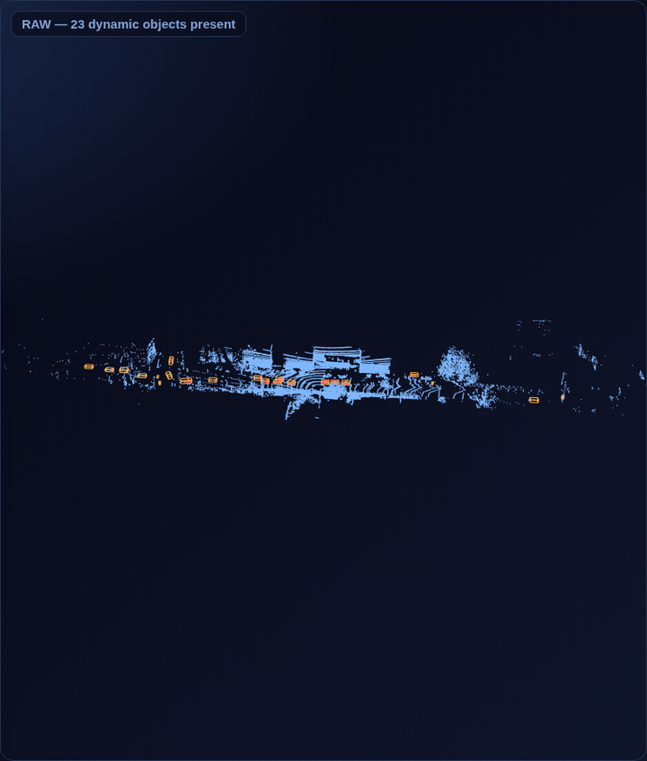
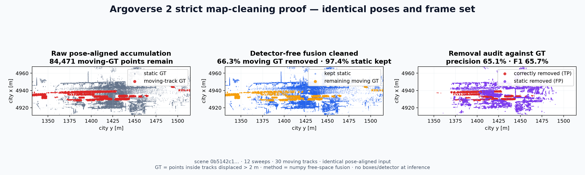
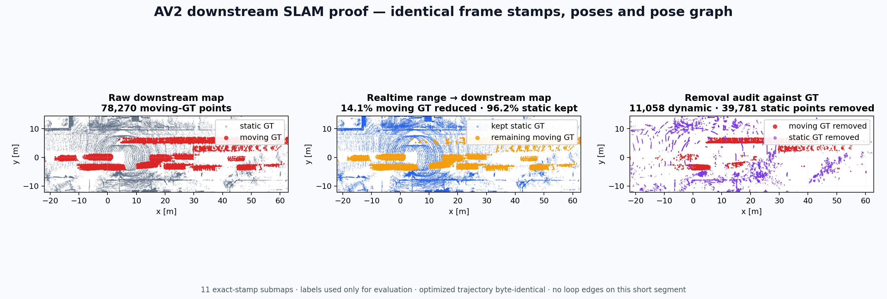

# Dynamic 3D Object Removal

[](https://github.com/rsasaki0109/dynamic-3d-object-removal/actions/workflows/test.yml)
[](https://rsasaki0109.github.io/dynamic-3d-object-removal/demo/playground.html)
[](https://github.com/rsasaki0109/dynamic-3d-object-removal/releases)

> **Keep moving objects from becoming LiDAR map ghosts.**

Detector-free, CPU-only LiDAR map cleaning and pose-aware ROS2 filtering. The real `numpy` implementation also runs in your browser — no GPU, no upload, no signup.

Accumulating scans from a moving scene can turn cars, pedestrians, and other transient returns into ghost geometry. This project uses geometric evidence across scans to reduce that contamination while preserving persistent structure, without requiring a learned detector.

[Try it in the browser](https://rsasaki0109.github.io/dynamic-3d-object-removal/demo/playground.html) · [Install and clean a map](#install) · [ROS2 quick start](#ros2-realtime) · [See the audited proof](#av2-detector-free-proof)

[](https://rsasaki0109.github.io/dynamic-3d-object-removal/demo/playground.html)

## Choose your path

| If you need to… | Start here | Key requirement |
|---|---|---|
| Clean a dense, pose-aligned accumulated map | [`fusion`](#algorithms) | Offline map cleaning; best fit for 64-beam-class data |
| Clean a sparse 32-beam map | [`range` ∩ `scan_ratio`](#algorithms) | Pose-aligned scans and range resolution matched to beam density |
| Filter a moving-platform ROS2 stream | [`range` or `temporal`](#ros2-realtime) | Timestamped TF into a fixed frame; input must be deskewed |
| Remove points using existing 3D boxes | [`box`](#algorithms) | Per-scan detections or annotations |
| Try the idea before installing anything | [Browser playground](https://rsasaki0109.github.io/dynamic-3d-object-removal/demo/playground.html) | Visual preview; no data leaves your browser |

### The problem this solves

A scan can look correct on its own while a sequence of scans quietly turns moving objects into map ghosts. Those trails make maps harder to inspect, maintain, and use downstream. The project separates three jobs — online scan filtering, online static mapping, and offline map cleaning — so the method and evidence match the task.



> Audited same-pose AV2 proof: 12 pose-aligned sweeps, 1,235,563 points, and 84,471 moving-track GT points. Detector-free `fusion` removes 66.3% of moving GT while keeping 97.4% of static GT. This is the main accuracy proof; the visual box-driven demos below are separate previews.

More demos: [AV2 sequence](https://rsasaki0109.github.io/dynamic-3d-object-removal/demo/index_3d_sequence_av2.html) · [single scan](https://rsasaki0109.github.io/dynamic-3d-object-removal/demo/index_3d_standalone.html) · [local sequence](https://rsasaki0109.github.io/dynamic-3d-object-removal/demo/index_3d_sequence_standalone.html)

## Install

```bash
pip install dynamic-object-removal
```

Pure-Python wheel, with `numpy` as the only required dependency. Optional extras are `[ros2]` for the ROS2 node and `[benchmarks]` for AV2/nuScenes scripts. From source: `git clone` followed by `pip install -e .`.

```bash
# Box-driven single scan
dynamic-object-removal \
  --input-cloud scan.pcd --input-objects objects.json \
  --output-cloud cleaned.pcd
```

- **Five algorithms, all numpy**: `box` (per-scan crop, needs 3D boxes), `temporal` (voxel consistency, optional visibility gate), `range` (range-image visibility, Removert-style remove + revert), `scan_ratio` (ERASOR-style per-column pseudo-occupancy + ground revert), `fusion` (dense-sensor offline map cleaner) — the last four are detector-free
- **Fast**: 1.5 ms for 24k points on CPU; **ROS2 realtime node** (`box` / `temporal` / `range`)
- **Minimal dependencies**: `numpy` only (`pyarrow` just for Argoverse 2 Feather input)

```bash
# Detector-free map cleaning
dynamic-object-removal \
  --algorithm range --input-map map.npy --input-cloud sweep.npy \
  --sensor-origin 0 0 0 --output-cloud cleaned.npy
```

## Algorithms

| Method | Use | Detector | Poses |
|---|---|---:|---:|
| `box` | Per-scan 3D-box crop | required | no |
| `temporal` | Streaming voxel consistency | no | moving sensors: yes |
| `range` | Range-image visibility + revert | no | yes |
| `scan_ratio` | Polar pseudo-occupancy + ground revert | no | yes |
| `fusion` | Offline free-space + void + scan-ratio fusion | no | yes |

Use `fusion` for dense offline maps, `range` (optionally intersected with `scan_ratio`) for sparse sensors, and `temporal` or `range` for realtime filtering.

For live per-scan filtering, use `box` when detections are available, or pose-aligned `temporal`/`range` without a detector. For offline maps, use `fusion` on dense sensors and `range` sized to the beam density (optionally intersected with `scan_ratio`) on sparse sensors.

## How It Compares

[ERASOR](https://github.com/LimHyungTae/ERASOR) and [Removert](https://github.com/gisbi-kim/removert) are offline map cleaners; this project also supports online per-scan filtering. This positioning table is from their papers, not a re-run benchmark.

| | This project | ERASOR | Removert |
|---|---|---|---|
| Primary goal | Per-scan / realtime removal + map cleaning | Offline static-map cleaning | Offline static-map cleaning |
| Needs a detector / 3D boxes | `box`: yes · others: no | No | No |
| Needs poses | `box`/`temporal`: no · map cleaners: yes | Yes | Yes |
| Online / realtime | **Yes** (ROS2 node) | No (batch) | No (batch) |
| Per-scan realtime | yes | no | no |
| Offline map cleaning | yes | yes | yes |
| Core stack | `numpy` only | C++ / ROS / PCL | C++ / ROS / PCL |

### Measured on Argoverse 2 (64-beam, 12 sweeps; 3-scene mean)

Detector-free methods only, reproducible with one command, no signup. Ground truth = points on objects whose track actually moved (parked cars don't count against a motion-based method). The three logs were selected by annotation-only screening for moving content; parameters were not tuned per scene.

| method (detector-free, 3-scene mean) | precision | recall | F1 | static points kept |
|---|---|---|---|---|
| **free-space fusion** (`fusion`, short-window thresholds) | 0.571 | **0.745** | **0.642** | 0.964 |
| range-image visibility (`range`) | 0.594 | 0.636 | 0.606 | 0.972 |
| scan-ratio pseudo-occupancy (`scan_ratio`) | **0.850** | 0.473 | 0.573 | **0.994** |
| temporal consistency (`temporal`, ungated) | 0.152 | **0.817** | 0.254 | 0.703 |
| temporal consistency (`temporal`, visibility-gated) | 0.556 | 0.629 | 0.586 | 0.968 |

> Logs `0b5142c1…`, `04994d08…`, and `05fa5048…` were selected by annotation-only screening for moving content. `fusion` needs relaxed short-window thresholds here (`0.7 / 3 / 4`, the script's defaults — the library defaults assume 100+ scans and drop F1 to 0.39). `range` is tunable toward precision (`--min-see-through 4` → ≈ 0.89). `scan_ratio` reaches a similar F1 through an independent signal (column occupancy vs line-of-sight); use a small fixed `--sr-min-votes` on short windows.

```bash
pip install awscli pyarrow
python3 scripts/run_av2_benchmark.py --scenes 0b5142c1-420b-3fea-9e98-b87327ae22c6 04994d08-156c-3018-9717-ba0e29be8153 05fa5048-f355-3274-b565-c0ddc547b315
```

### Also measured on nuScenes (32-beam, sparse; 6-scene eligible mean)

On a ~5× sparser sensor the one change that matters: **match the range-image resolution to beam density** (`2.5°` vs AV2's `1.0°`).
Single-scene results overstate transfer; means over all eligible mini scenes are reported instead. The mean is unweighted over six scenes; scenes with fewer than 5,000 GT dynamic points are listed by the benchmark but excluded from the mean.

| method (detector-free, 6-scene eligible mean) | precision | recall | F1 | static points kept |
|---|---|---|---|---|
| **range ∧ scan-ratio** (intersection) | **0.297** | 0.263 | **0.240** | **0.931** |
| temporal consistency (`temporal`, visibility-gated) | 0.251 | 0.382 | 0.236 | 0.880 |
| scan-ratio pseudo-occupancy (`scan_ratio`) | 0.247 | 0.331 | 0.231 | 0.825 |
| range-image visibility (`range`) | 0.127 | **0.499** | 0.187 | 0.801 |
| temporal consistency (`temporal`, ungated) | 0.107 | **0.797** | 0.158 | 0.401 |

> Busy-scene best-case example (not typical): `scene-0757`, 12 keyframes, 303,120 map points, 48,529 GT points. Its `range ∧ scan_ratio` result is F1 0.642 / static 0.842. The fine AV2 `1.0°` resolution is a poor fit here. `scan_ratio`'s column signal is more sparsity-sensitive (high recall, weak precision) — but its false positives are nearly disjoint from `range`'s, so **intersecting the two dynamic masks** gives the best precision-side numbers at no extra cost. `fusion` is not suited to sparse sensors: beyond ~13 m the beam spacing exceeds the carving voxel and static walls get carved between beams; coarser voxels don't recover it (measured F1 < 0.3).

```bash
python3 scripts/run_nuscenes_benchmark.py --scenes all   # downloads nuScenes mini once, ~3.9 GB, no signup
```

### Historical single-scene proof snapshots

The upstream proof artifacts are retained here as single-scene reference points. They are useful for reproducing the checked-in images, but the multi-scene means above are the transfer-oriented headline numbers.

#### AV2 detector-free proof

Argoverse 2 — 64-beam, 12 sweeps.

| Detector-free method | Precision | Recall | F1 | Static kept |
|---|---:|---:|---:|---:|
| **`fusion`** | 0.65 | **0.66** | **0.66** | 0.97 |
| `range` | **0.68** | 0.54 | 0.60 | 0.98 |
| `scan_ratio` | 0.66 | 0.56 | 0.61 | 0.98 |
| `temporal` | 0.19 | 0.72 | 0.30 | 0.78 |


The AV2 proof uses 12 pose-aligned sweeps, 1,235,563 points, and 84,471 moving-track GT points. `fusion` removes 66.3% of moving GT while keeping 97.4% of static GT; boxes are used only for evaluation. [Counts and configuration](demo/av2_gt_map_proof.json).

For short windows, use `free_votes_fraction=0.7`, `free_votes_floor=3`, and `void_min_scans=4`; long-map defaults assume 100+ scans. Sparse 32-beam data favors a coarser range-image resolution (`2.5°` on nuScenes) and should not use `fusion` by default.

#### nuScenes mini — 32-beam, 12 keyframes

| Detector-free method | Precision | Recall | F1 | Static kept |
|---|---:|---:|---:|---:|
| **`range ∩ scan_ratio`** | **0.51** | 0.87 | **0.64** | **0.84** |
| `range` | 0.48 | **0.92** | 0.63 | 0.81 |
| `scan_ratio` | 0.36 | 0.90 | 0.51 | 0.69 |
| `fusion` | 0.16 | 0.32 | 0.22 | 0.68 |
| `temporal` | 0.07 | 0.22 | 0.11 | 0.47 |

### Semantic-KITTI — DynamicMap Benchmark

| Method | seq 00 SA | seq 00 DA | seq 00 AA | seq 05 SA | seq 05 DA | seq 05 AA |
|---|---:|---:|---:|---:|---:|---:|
| **`fusion`** | 98.9 | **98.3** | **98.6** | 98.0 | **98.1** | **98.0** |
| `scan_ratio` | 98.0 | 92.8 | 95.4 | 96.0 | 97.9 | 96.9 |
| `range` | **99.6** | 34.5 | 58.6 | **99.8** | 25.9 | 50.9 |
| `temporal` | 97.0 | 46.6 | 67.2 | 97.3 | 25.9 | 50.2 |

The separate [20-frame AV2 sequence](https://rsasaki0109.github.io/dynamic-3d-object-removal/demo/index_3d_sequence_av2.html) is a **box-driven annotation crop**. Its 233,460 removed points include parked objects and are not reported as moving-object GT.

Reproduce the benchmarks:

```bash
python3 scripts/run_av2_benchmark.py --frames 12 --stride 3 --sr-min-votes 2
python3 scripts/run_nuscenes_benchmark.py
python3 scripts/run_dynamicmap_benchmark.py --sequences 00 05
```

## Quick Start On Public Data

Real [Argoverse 2](https://www.argoverse.org/av2.html) data in three commands, with no signup:

```bash
pip install awscli pyarrow
python3 scripts/download_av2_sample.py

dynamic-object-removal \
  --input-cloud data/av2_sample/lidar/315969904359876000.feather \
  --input-objects data/av2_sample/annotations.feather \
  --timestamp-ns 315969904359876000 \
  --output-cloud output/av2_cleaned.pcd

python3 demo/run_scan_demo.py \
  --input-cloud data/av2_sample/lidar/315969904359876000.feather \
  --input-objects data/av2_sample/annotations.feather \
  --timestamp-ns 315969904359876000 \
  --max-render-points 50000 \
  --output-html demo/index_3d_av2.html
```

> This sample removes 3,406 of 95,381 points (3.6%); static road and buildings remain. KITTI is also supported via `scripts/download_kitti_sample.py`.

## ROS2 Realtime

```bash
dynamic-object-removal-realtime \
  --pointcloud-topic /velodyne_points --output-topic /cleaned_points \
  --algorithm range --fixed-frame odom --range-window 3 \
  --expected-rate-hz 10 --summary-json dor_summary.json
```

The same node supports detector-driven boxes and detector-free temporal filtering:

```bash
# Box-driven with an external detector
dynamic-object-removal-realtime \
  --pointcloud-topic /velodyne_points --objects-topic /detected_objects \
  --output-topic /cleaned_points --algorithm box

# Detector-free temporal consistency
dynamic-object-removal-realtime \
  --pointcloud-topic /velodyne_points --output-topic /cleaned_points \
  --algorithm temporal --voxel-size 0.10 \
  --temporal-window 5 --temporal-min-hits 3
```

On a moving platform, `temporal` and `range` require timestamped `fixed_frame <- cloud_frame` TF. Missing, invalid, or stale TF fails open: the scan is published unchanged and excluded from history. Input must already be deskewed; omit `--fixed-frame` only for a fixed sensor or clouds already expressed in one shared frame.

For one-pass sequence accuracy, latency, confirmation delay, fail-open, and pose-noise evaluation, use [`scripts/run_online_benchmark.py`](scripts/run_online_benchmark.py).

## Downstream SLAM Proof



The experimental [`lidarslam_ros2` integration](examples/lidarslam_ros2/README.md) feeds exact-stamp raw and cleaned clouds to the same map backend. On AV2, both branches use 11 identical cloud/odometry pairs and byte-identical trajectories and loop-edge artifacts. Realtime `range` reduces moving-GT map points by **14.1%**, keeps **96.2%** of static-GT points, and has **21.8%** removed-point precision. This is integration evidence; the offline `fusion` result above remains the accuracy headline. [Full contract and hashes](examples/lidarslam_ros2/av2_downstream_gt_map_proof.json).

Keep these tasks separate:

| Task | Evidence |
|---|---|
| Online moving-object segmentation | Per-scan F1/IoU, static keep, confirmation delay, latency |
| Online static mapping | Same-pose raw/cleaned ghost and structure comparison |
| Offline map cleaning | Final-map point metrics or SA/DA/AA |

`temporal` keeps its legacy hit-count behavior by default. Pass `--temporal-visibility` to enable the opt-in spherical visibility gate; ROS2 also exposes `--temporal-visibility-h-res`, `--temporal-visibility-v-res`, `--temporal-visibility-margin`, `--temporal-visibility-fraction`, and `--temporal-visibility-min-hits` (`--no-visibility` makes the default explicit). On AV2, the 3-scene mean improves from F1 0.254 to 0.586 and static points kept from 0.703 to 0.968. The vectorized filter takes about 128 ms/100k points ungated or 162 ms gated (old Counter path: 516 ms).

## Python API

```python
from pathlib import Path
from dynamic_object_removal import load_points, load_boxes, remove_points_in_boxes, save_points

points = load_points(Path("/path/to/scan.pcd"), fmt="auto")
boxes = load_boxes(Path("/path/to/objects.json"), fmt="auto", skip_invalid=True)
kept, keep_mask = remove_points_in_boxes(points, boxes, margin=(0.05, 0.05, 0.05))

save_points(Path("/path/to/output.xyz"), kept, fmt="auto")

# The same APIs also support the minimal form used by the CLI examples:
points = load_points(Path("scan.pcd"), fmt="auto")
boxes = load_boxes(Path("objects.json"), fmt="auto")
cleaned, keep = remove_points_in_boxes(points, boxes)
save_points(Path("cleaned.pcd"), cleaned, fmt="auto")
```

Main public APIs:

- `load_points(path, fmt="auto")` / `load_boxes(path, fmt="auto", skip_invalid=False)` / `save_points(path, fmt="auto")`
- `remove_points_in_boxes(points, boxes, margin=(0.05, 0.05, 0.05))`
- `TemporalConsistencyFilter(voxel_size=0.10, window_size=5, min_hits=3, visibility=False)`
- `remove_ghost_by_range_image(map_points, query_points, sensor_origin, range_margin=0.5)` — single map-vs-scan visibility removal
- `clean_map_by_visibility(map_points, scans, min_see_through=2, max_surface_hits=2, ground_z=None, resolutions=None)` — multi-scan map cleaner (remove + revert)
- `remove_dynamic_by_scan_ratio(map_points, query_points, sensor_origin, scan_ratio_threshold=0.2, ground_margin=0.2)` — single map-vs-scan scan-ratio removal
- `clean_map_by_scan_ratio(map_points, scans, scan_ratio_threshold=0.2, min_votes=None, votes_fraction=0.5, votes_floor=3)` — multi-scan scan-ratio cleaner (`min_votes=None` = majority of each point's column revisits)
- `clean_map_by_fusion(map_points, scans, workers=1)` — highest-accuracy map cleaner
- `RangeImageGhostFilter(window_size=5, range_margin=0.5)` — streaming range-image filter for ROS2

### Range-image visibility removal

```python
# scans: list of (points_in_map_frame, sensor_origin) from the sweeps that built the map.
kept, keep_mask = clean_map_by_visibility(
    map_points, scans,
    range_margin=0.5, min_see_through=2, max_surface_hits=2, ground_z=-1.4,
)
```

A point is removed only when enough scans see *through* it **and** few confirm it as a real surface (the Removert-style *revert* guard). For higher precision pass `resolutions=[2.5, 4.0]` (multi-resolution consensus: AV2 precision 0.68 → 0.78). Try it in the playground's **Range mode**.

### Scan-ratio (pseudo-occupancy) removal

```python
kept, keep_mask = clean_map_by_scan_ratio(
    map_points, scans,
    scan_ratio_threshold=0.2, min_map_height=0.5, ground_margin=0.2,
)
```

ERASOR-style and independent of visibility: a polar column that is tall in the map but flat in a live sweep held a moving object; above-ground points are removed, the ground reverted by a per-column plane fit. Strongest on dense (64-beam+) LiDAR; on sparse sensors prefer `range` or raise `votes_fraction`.

### Free-space fusion (highest accuracy)

```python
kept, keep_mask = clean_map_by_fusion(map_points, scans, workers=6)
```

Fusion ORs three independent dynamic-evidence channels: ray-sampled free-space carving with per-scan hit precedence, DUFOMap-style eroded-void confirmation, and scan-ratio votes. Fractional free-space voting catches transient traffic while absolute void counts catch slower movers; the union reaches KITTI AA **98.6 / 98.0**. Carving is the cost: minutes per hundred 64-beam scans with `workers=6`, versus seconds for `range`/`scan_ratio`. For short windows (~12 scans), use `free_votes_fraction=0.7`, `free_votes_floor=3`, and `void_min_scans=4`; on sparse 32-beam sensors, prefer `range`.

Main APIs: `TemporalConsistencyFilter`, `RangeImageGhostFilter`, `clean_map_by_visibility`, `clean_map_by_scan_ratio`, and `clean_map_by_fusion`. See their docstrings and [`dynamic_object_removal.py`](dynamic_object_removal.py).

Supported point clouds: PCD (ASCII/binary), CSV, TXT, XYZ, NPY, KITTI BIN, and AV2 Feather. Boxes: JSON, CSV, KITTI `label_2`, and AV2 Feather. `PCD DATA binary_compressed` is not supported.

## Demo Regeneration

```bash
python3 demo/run_scan_demo.py \
  --input-cloud demo/actual_scan_20240820_cloud.pcd \
  --input-objects demo/actual_scan_20240820_objects.json \
  --max-render-points 220000 \
  --output-scene demo/demo_scene_single_scan.json \
  --output-html demo/index_3d_standalone.html

python3 demo/run_scan_sequence_demo.py \
  --input-glob "/path/to/graph/*/cloud.pcd" \
  --frame-count 12 --stride 1 --max-render-points 9000 --fps 4 \
  --voxel-size 0.35 --window-size 5 --min-hits 3 \
  --output-html demo/index_3d_sequence_standalone.html
```

The checked-in HTML demos are self-contained and embed sampled point data.

More demos: [single scan](https://rsasaki0109.github.io/dynamic-3d-object-removal/demo/index_3d_standalone.html) · [temporal sequence](https://rsasaki0109.github.io/dynamic-3d-object-removal/demo/index_3d_sequence_standalone.html).

## Related Work

- [UTS-RI/dynamic_object_detection](https://github.com/UTS-RI/dynamic_object_detection)
