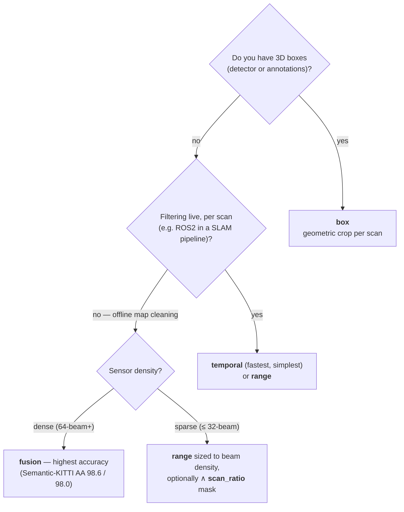
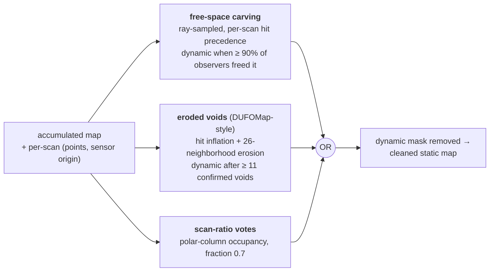

# Dynamic 3D Object Removal

[](https://github.com/rsasaki0109/dynamic-3d-object-removal/actions/workflows/test.yml)
[](https://rsasaki0109.github.io/dynamic-3d-object-removal/demo/playground.html)
[](https://github.com/rsasaki0109/dynamic-3d-object-removal/releases)

**No GPU, numpy-only, geometry-based.** Removes dynamic objects (vehicles, pedestrians, cyclists) from LiDAR scans and accumulated maps — no deep learning, `numpy` the only dependency.

## Start Here

- **🕹️ Browser playground (no install)**: https://rsasaki0109.github.io/dynamic-3d-object-removal/demo/playground.html — the real library running client-side via Pyodide. **Box / Range / Temporal** modes, AV2 64-beam and nuScenes 32-beam presets, shareable URLs, or drop your own PCD.

  [](https://rsasaki0109.github.io/dynamic-3d-object-removal/demo/playground.html)

- More demos: [AV2 box-driven sequence](https://rsasaki0109.github.io/dynamic-3d-object-removal/demo/index_3d_sequence_av2.html) · [single scan](https://rsasaki0109.github.io/dynamic-3d-object-removal/demo/index_3d_standalone.html) · [local temporal sequence](https://rsasaki0109.github.io/dynamic-3d-object-removal/demo/index_3d_sequence_standalone.html)


> Strict same-input proof: 12 pose-aligned AV2 sweeps, 1,235,563 points and 84,471
> moving-track GT points. Detector-free `fusion` removes 66.3% of moving GT while
> keeping 97.4% of static GT (precision 65.1%, F1 65.7%). Boxes define evaluation
> GT only; inference does not use boxes. Full counts and configuration are checked in
> at [`demo/av2_gt_map_proof.json`](demo/av2_gt_map_proof.json).

The interactive 20-frame AV2 sequence is a separate **box-driven annotation crop**:
its 233,460 removed points include all annotated objects in those frames, including
parked objects, so that count is intentionally not reported as moving-object GT or a
detector-free accuracy result.

### Features

- **Five algorithms, all numpy**: `box` (per-scan crop, needs 3D boxes), `temporal` (voxel consistency), `range` (range-image visibility, Removert-style remove + revert), `scan_ratio` (ERASOR-style per-column pseudo-occupancy + ground revert), `fusion` (highest-accuracy map cleaner) — the last four are detector-free
- **Fast**: 1.5 ms for 24k points on CPU; **ROS2 realtime node** (`box` / `temporal` / `range`)
- **Minimal dependencies**: `numpy` only (`pyarrow` just for Argoverse 2 Feather input)

### Which algorithm?

Every branch is backed by a measurement below:


```mermaid
flowchart TD
    Q1{"Do you have 3D boxes<br/>(detector or annotations)?"}
    Q2{"Filtering live, per scan<br/>(e.g. ROS2 in a SLAM pipeline)?"}
    Q3{"Sensor density?"}
    BOX["<b>box</b><br/>geometric crop per scan"]
    RT["<b>temporal</b> (fastest, simplest)<br/>or <b>range</b>"]
    FUSION["<b>fusion</b> — highest accuracy<br/>(Semantic-KITTI AA 98.6 / 98.0)"]
    SPARSE["<b>range</b> sized to beam density,<br/>optionally ∧ <b>scan_ratio</b> mask"]
    Q1 -- "yes" --> BOX
    Q1 -- "no" --> Q2
    Q2 -- "yes" --> RT
    Q2 -- "no — offline map cleaning" --> Q3
    Q3 -- "dense (64-beam+)" --> FUSION
    Q3 -- "sparse (≤ 32-beam)" --> SPARSE
```

## How It Compares

[ERASOR](https://github.com/LimHyungTae/ERASOR) (RA-L '21) and [Removert](https://github.com/gisbi-kim/removert) (IROS '20) clean a *finished, pose-aligned map offline*; this project also covers *online, per-scan* use. Positioning guide (from their papers, **not** a re-run benchmark):

| | **This project** | ERASOR | Removert |
|---|---|---|---|
| Primary goal | Per-scan / realtime removal + map cleaning | Offline static-map cleaning | Offline static-map cleaning |
| Needs a detector / 3D boxes | `box`: yes · others: no | No | No |
| Needs poses | `box`: no · streaming `temporal`/`range`: TF on a moving platform · map cleaners: yes | Yes | Yes |
| Online / realtime | **Yes** (ROS2 node) | No (batch) | No (batch) |
| Core stack | `numpy` only | C++ / ROS / PCL | C++ / ROS / PCL |

### Measured on Argoverse 2 (64-beam, 12 sweeps)

Detector-free methods only, reproducible with one command, no signup. Ground truth = points on objects whose track actually moved (parked cars don't count against a motion-based method).

| method (detector-free) | precision | recall | F1 | static points kept |
|---|---|---|---|---|
| **free-space fusion** (`fusion`, short-window thresholds) | 0.65 | **0.66** | **0.66** | 0.97 |
| **range-image visibility** (`range`) | **0.68** | 0.54 | 0.60 | 0.98 |
| **scan-ratio** pseudo-occupancy (`scan_ratio`, `--sr-min-votes 2`) | 0.66 | 0.56 | 0.61 | 0.98 |
| temporal consistency (`temporal`) | 0.19 | 0.72 | 0.30 | 0.78 |

> Scene `0b5142c1…`, 1.24 M points, 84 k GT points. `fusion` needs relaxed short-window thresholds here (`0.7 / 3 / 4`, the script's defaults — the library defaults assume 100+ scans and drop F1 to 0.39). `range` is tunable toward precision (`--min-see-through 4` → ≈ 0.89). `scan_ratio` reaches a similar F1 through an independent signal (column occupancy vs line-of-sight); use a small fixed `--sr-min-votes` on short windows.

```bash
pip install awscli pyarrow
python3 scripts/run_av2_benchmark.py --frames 12 --stride 3 --sr-min-votes 2 \
  --summary-json demo/av2_gt_map_proof.json \
  --proof-png demo/av2_gt_map_proof.png
```

### Also measured on nuScenes (32-beam, sparse)

On a ~5× sparser sensor the one change that matters: **match the range-image resolution to beam density** (`2.5°` vs AV2's `1.0°`).

| method (detector-free) | precision | recall | F1 | static points kept |
|---|---|---|---|---|
| **range ∧ scan-ratio** (intersection) | **0.51** | 0.87 | **0.64** | **0.84** |
| range-image visibility (`range`) | 0.48 | **0.92** | 0.63 | 0.81 |
| scan-ratio pseudo-occupancy (`scan_ratio`) | 0.36 | **0.90** | 0.51 | 0.69 |
| free-space fusion (`fusion`, short-window thresholds) | 0.16 | 0.32 | 0.22 | 0.68 |
| temporal consistency (`temporal`) | 0.07 | 0.22 | 0.11 | 0.47 |

> `scene-0757`, 12 keyframes, 303 k points, 49 k GT points. AV2's fine `1.0°` resolution collapses F1 to ~0.30 here. `scan_ratio`'s column signal is more sparsity-sensitive (high recall, weak precision) — but its false positives are nearly disjoint from `range`'s, so **intersecting the two dynamic masks** gives the best precision-side numbers at no extra cost. `fusion` is not suited to sparse sensors: beyond ~13 m the beam spacing exceeds the carving voxel and static walls get carved between beams; coarser voxels don't recover it (measured F1 < 0.3).

```bash
python3 scripts/run_nuscenes_benchmark.py   # downloads nuScenes mini once, ~3.9 GB, no signup
```

### Measured on Semantic-KITTI (DynamicMap_Benchmark)

[KTH-RPL DynamicMap_Benchmark](https://github.com/KTH-RPL/DynamicMap_Benchmark) teaser sequences (Zenodo, no signup), the benchmark's SA / DA / AA metrics. Our methods only.

| method | seq 00 SA | seq 00 DA | seq 00 AA | seq 05 SA | seq 05 DA | seq 05 AA |
|---|---|---|---|---|---|---|
| **free-space fusion** (`fusion`) | 98.9 | **98.3** | **98.6** | 98.0 | **98.1** | **98.0** |
| **scan-ratio** pseudo-occupancy (`scan_ratio`) | 98.0 | 92.8 | 95.4 | 96.0 | 97.9 | 96.9 |
| **range-image visibility** (`range`) | **99.6** | 34.5 | 58.6 | **99.8** | 25.9 | 50.9 |
| temporal consistency (`temporal`) | 97.0 | 46.6 | 67.2 | 97.3 | 25.9 | 50.2 |

> seq 00: 141 scans / 17.4 M points; seq 05: 321 scans / 39.9 M points. `fusion` matches the leaderboard-topping DUFOMap on seq 00 (AA 98.6) and exceeds every listed method on seq 05 (98.0 vs 96.3); the learning-based, GPU-trained 4dNDF (AA ≈ 99) is outside this numpy-only class. Channel thresholds were tuned on these two sequences, like most leaderboard entries — cross-dataset transfer is what the AV2/nuScenes sections above measure.

```bash
python3 scripts/run_dynamicmap_benchmark.py --sequences 00 05   # ~385 MB per sequence
```

## Installation

```bash
pip install dynamic-object-removal
```

Pure-Python wheel, `numpy` the only dependency. Extras: `[ros2]` (ROS2 node), `[benchmarks]` (AV2/nuScenes scripts). From source: `git clone` + `pip install -e .`

## Quick Start On Public Data

Real [Argoverse 2](https://www.argoverse.org/av2.html) data in three commands, no signup:

```bash
# 1. Download an AV2 sample (1 sweep + annotations, ~1.3 MB)
pip install awscli pyarrow
python3 scripts/download_av2_sample.py

# 2. Remove dynamic objects (18 vehicles, 3 pedestrians, 1 bicycle, 1 wheelchair)
dynamic-object-removal \
  --input-cloud data/av2_sample/lidar/315969904359876000.feather \
  --input-objects data/av2_sample/annotations.feather \
  --timestamp-ns 315969904359876000 \
  --output-cloud output/av2_cleaned.pcd

# 3. Inspect before/after in 3D
python3 demo/run_scan_demo.py \
  --input-cloud data/av2_sample/lidar/315969904359876000.feather \
  --input-objects data/av2_sample/annotations.feather \
  --timestamp-ns 315969904359876000 \
  --max-render-points 50000 \
  --output-html demo/index_3d_av2.html
```

> Removes 3,406 of 95,381 points (3.6%); static road and buildings remain. KITTI is also supported: `scripts/download_kitti_sample.py`.

## CLI

```bash
# Box-driven (needs detected boxes)
dynamic-object-removal \
  --input-cloud /path/to/scan.pcd \
  --input-objects /path/to/objects.json \
  --output-cloud /path/to/output.xyz

# Detector-free map cleaning (swap range for scan_ratio as needed)
dynamic-object-removal \
  --algorithm range \
  --input-map accumulated_map.npy \
  --input-cloud query_sweep.npy \
  --sensor-origin 0 0 0 \
  --output-cloud cleaned_map.npy
```

## ROS2 Realtime Node

Subscribes to `PointCloud2`, filters, publishes:

```bash
# Box-driven with an external detector
dynamic-object-removal-realtime \
  --pointcloud-topic /velodyne_points \
  --objects-topic /detected_objects \
  --output-topic /cleaned_points \
  --algorithm box

# Detector-free temporal consistency on a moving platform.
# The cloud timestamp and frame_id are used to query TF: odom <- velodyne.
dynamic-object-removal-realtime \
  --pointcloud-topic /velodyne_points \
  --output-topic /cleaned_points \
  --algorithm temporal \
  --fixed-frame odom \
  --voxel-size 0.10 --temporal-window 5 --temporal-min-hits 3
```

`temporal` and streaming `range` compare the current scan with recent scans. On a
moving platform, pass `--fixed-frame odom` (or `map`) so the node looks up the
timestamped `fixed_frame <- PointCloud2.header.frame_id` transform and maintains its
history in one coordinate frame. If TF is unavailable, invalid, or stale, the node
fails open: it publishes that scan unchanged and does not add the unaligned scan to
the filter history. TF alignment and fail-open counts are included in `--summary-json`.
Pass `--expected-rate-hz 10` to also infer dropped frames from timestamp gaps; the
summary separates decode, filter, publish, and total callback latency.

Omit `--fixed-frame` only for a fixed sensor or when every incoming cloud is already
expressed in one shared frame. The node applies one rigid transform at the cloud header
timestamp; input clouds must already be deskewed when platform motion during a LiDAR
sweep is significant. Published points retain the input coordinates and header.

The ROS environment must provide `tf2_ros` when `--fixed-frame` is used (for example,
`sudo apt install ros-$ROS_DISTRO-tf2-ros`).
The node uses a two-thread executor, allowing a transform published just after a cloud
at the same timestamp to satisfy the bounded lookup.

### Online sequence benchmark

`dynamic-object-removal-bench` is a single-cloud speed microbenchmark. To evaluate
streaming behavior, replay a pose/GT sequence once in timestamp order:

```bash
# Reuse the public AV2 selection and its "tracks that actually moved" GT.
python3 scripts/run_av2_benchmark.py \
  --frames 12 --stride 3 \
  --online-manifest data/av2_online.json --online-only

python3 scripts/run_online_benchmark.py \
  --manifest data/av2_online.json \
  --algorithm range \
  --range-window 3 --range-h-res 1.0 --range-v-res 1.0 \
  --pose-noise-translation 0.02 0.05 0.10 \
  --pose-noise-yaw 0.1 0.5 1.0 \
  --summary-json data/av2_online_temporal.json
```

The JSON records point-wise precision/recall/F1/IoU, static preservation, warm-up and
time-to-confirm, per-frame and p50/p95/max filter latency, deadline misses, fail-open
frames, sensor profile, and pose-noise sweeps. This is an **online moving-object
segmentation** result; do not compare it directly with the final-map SA/DA/AA numbers
from the offline DynamicMap benchmark.

### Keep the evaluation tasks separate

The repository exercises three related tasks with different evidence. Their metrics
are not interchangeable:

| task | input/output | evidence in this repository |
|---|---|---|
| Online moving-object segmentation | Timestamped scans → per-scan moving/static mask | One-pass sequence F1/IoU, static preservation, confirmation delay, filter latency |
| Online static mapping | Deskewed scans + live odometry → incrementally built map | Same-bag raw/cleaned ghost reduction, matched static retention, end-to-end callback latency |
| Offline map cleaning | Finished pose-aligned scans/map → cleaned final map | AV2/nuScenes point metrics and DynamicMap SA/DA/AA |

The experimental `lidarslam_ros2` wiring evaluates the second task: its frontend
odometry is held fixed and DOR filters the deskewed cloud before the map backend. It
does not establish an odometry improvement or an offline-cleaning result. See
[`examples/lidarslam_ros2/README.md`](examples/lidarslam_ros2/README.md).

The TIERS Indoor02 engineering run now builds both branches from one RKO-LIO frontend:
377 exact-stamp paired frames, zero pose fail-open, identical pose graphs, 99.74%
dense-structure proxy retention, and sparse baseline-only candidates. Because this bag
has no dynamic point GT, that is an integration/map-structure result—not a ghost
accuracy claim or the 10 Hz latency gate.


The complementary AV2 downstream run uses the graph backend's deterministic bag
runner: raw and cleaned branches each consume the same 11 exact-stamp cloud/odometry
pairs and produce byte-identical raw/optimized trajectories and loop-edge artifacts.
Against moving-track point GT, realtime `range` reduces moving-GT map points by 14.1%
while retaining 96.2% of static-GT map points. Removed-point precision is only 21.8%,
so this is integration evidence—not a replacement for the stronger offline `fusion`
benchmark above. Labels are withheld from filtering and used only by the map evaluator.
See the [full contract, counts, hashes, and commands](examples/lidarslam_ros2/README.md).

## Library API

```python
from pathlib import Path
from dynamic_object_removal import load_points, load_boxes, remove_points_in_boxes, save_points

points = load_points(Path("/path/to/scan.pcd"), fmt="auto")
boxes = load_boxes(Path("/path/to/objects.json"), fmt="auto", skip_invalid=True)
kept, keep_mask = remove_points_in_boxes(points, boxes, margin=(0.05, 0.05, 0.05))

save_points(Path("/path/to/output.xyz"), kept, fmt="auto")
```

Main public APIs:

- `load_points(path, fmt="auto")` / `load_boxes(path, fmt="auto", skip_invalid=False)` / `save_points(path, fmt="auto")`
- `remove_points_in_boxes(points, boxes, margin=(0.05, 0.05, 0.05))`
- `TemporalConsistencyFilter(voxel_size=0.10, window_size=5, min_hits=3)`
- `remove_ghost_by_range_image(map_points, query_points, sensor_origin, range_margin=0.5)` — single map-vs-scan visibility removal
- `clean_map_by_visibility(map_points, scans, min_see_through=2, max_surface_hits=2, ground_z=None, resolutions=None)` — multi-scan map cleaner (remove + revert)
- `remove_dynamic_by_scan_ratio(map_points, query_points, sensor_origin, scan_ratio_threshold=0.2, ground_margin=0.2)` — single map-vs-scan scan-ratio removal
- `clean_map_by_scan_ratio(map_points, scans, scan_ratio_threshold=0.2, min_votes=None, votes_fraction=0.5, votes_floor=3)` — multi-scan scan-ratio cleaner (`min_votes=None` = majority of each point's column revisits)
- `clean_map_by_fusion(map_points, scans, workers=1)` — highest-accuracy map cleaner
- `RangeImageGhostFilter(window_size=5, range_margin=0.5)` — streaming range-image filter for ROS2

### Range-image visibility removal

```python
# scans: list of (points_in_map_frame, sensor_origin) from the sweeps that built the map.
kept, keep_mask = clean_map_by_visibility(
    map_points, scans,
    range_margin=0.5, min_see_through=2, max_surface_hits=2, ground_z=-1.4,
)
```

A point is removed only when enough scans see *through* it **and** few confirm it as a real surface (the Removert-style *revert* guard). For higher precision pass `resolutions=[2.5, 4.0]` (multi-resolution consensus: AV2 precision 0.68 → 0.78). Try it in the playground's **Range mode**.

### Scan-ratio (pseudo-occupancy) removal

```python
kept, keep_mask = clean_map_by_scan_ratio(
    map_points, scans,
    scan_ratio_threshold=0.2, min_map_height=0.5, ground_margin=0.2,
)
```

ERASOR-style and independent of visibility: a polar column that is tall in the map but flat in a live sweep held a moving object; above-ground points are removed, the ground reverted by a per-column plane fit. Strongest on dense (64-beam+) LiDAR; on sparse sensors prefer `range` or raise `votes_fraction`.

### Free-space fusion (highest accuracy)

```python
kept, keep_mask = clean_map_by_fusion(map_points, scans, workers=6)
```

Three independent dynamic-evidence channels, OR-fused:


```mermaid
flowchart LR
    MAP["accumulated map<br/>+ per-scan (points, sensor origin)"]
    FS["<b>free-space carving</b><br/>ray-sampled, per-scan hit precedence<br/>dynamic when ≥ 90% of observers freed it"]
    EV["<b>eroded voids</b> (DUFOMap-style)<br/>hit inflation + 26-neighborhood erosion<br/>dynamic after ≥ 11 confirmed voids"]
    SR["<b>scan-ratio votes</b><br/>polar-column occupancy, fraction 0.7"]
    OR(("OR"))
    OUT["dynamic mask removed →<br/>cleaned static map"]
    MAP --> FS
    MAP --> EV
    MAP --> SR
    FS --> OR
    EV --> OR
    SR --> OR
    OR --> OUT
```

Fractional free-space voting nails transient traffic; absolute void counts catch slow movers and late leavers — the union scores high on both (KITTI AA **98.6 / 98.0**). Carving is the cost: minutes per hundred 64-beam scans with `workers=6`, vs seconds for `range`/`scan_ratio`.

**Sizing to your data**: defaults assume a long (100+ scan) dense-sensor sequence. For short windows (~12 scans) relax to `free_votes_fraction=0.7, free_votes_floor=3, void_min_scans=4`. On sparse (32-beam) sensors use `range` instead (measured on nuScenes above).

## Demo Regeneration

```bash
# Single scan
python3 demo/run_scan_demo.py \
  --input-cloud demo/actual_scan_20240820_cloud.pcd \
  --input-objects demo/actual_scan_20240820_objects.json \
  --max-render-points 220000 \
  --output-scene demo/demo_scene_single_scan.json \
  --output-html demo/index_3d_standalone.html

# Sequence (temporal-cleaned; pass --input-objects / --input-poses for box-driven, pose-aligned)
python3 demo/run_scan_sequence_demo.py \
  --input-glob "/path/to/graph/*/cloud.pcd" \
  --frame-count 12 --stride 1 --max-render-points 9000 --fps 4 \
  --voxel-size 0.35 --window-size 5 --min-hits 3 \
  --output-html demo/index_3d_sequence_standalone.html
```

The checked-in HTML demos are self-contained (sampled point data embedded).

## Supported Formats

- Point clouds: `PCD` (ASCII / binary), `CSV`, `TXT`, `XYZ`, `NPY`, `BIN` (KITTI), `Feather` (Argoverse 2)
- Bounding boxes: `JSON`, `CSV`, `KITTI label_2`, `Feather` (Argoverse 2)
- `PCD DATA binary_compressed` is not supported

## Related Work

- [UTS-RI/dynamic_object_detection](https://github.com/UTS-RI/dynamic_object_detection)

## Releasing (maintainers)

Releases publish to PyPI via [Trusted Publishing](https://docs.pypi.org/trusted-publishers/) on tag push. Bump `__version__` in `dynamic_object_removal.py`, commit, then:

```bash
git tag v0.6.0
git push origin v0.6.0
```
